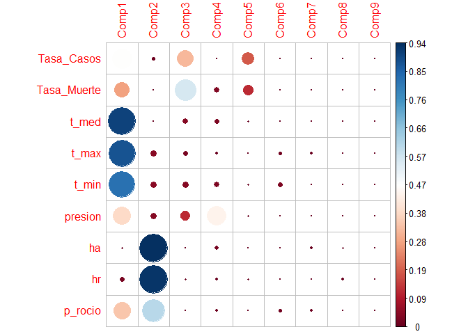
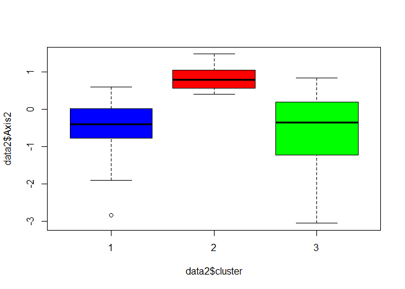

Readme
================
Grupo\_08
10/9/2021

# ANALISIS EXPLORATORIO

**Primero Cargamos las librerias**

``` r
library(PerformanceAnalytics)
library(GGally)
library(lattice)
library(cptcity)
library(psych)
library(readxl)
library(mice)
library(VIM)
library(tidyverse)
library(dplyr)
library(factoextra)
library(NbClust)
library(ade4)
library(factoextra)
library(corrplot)
library(rgl)
library(NbClust)
library(LICORS)
library(clusterSim)
library(clValid)
```

## Análisis EDA

**Leemos los datos**

``` r
data <- read_xls("Mundial.xls") %>% 
  dplyr::select(-Paises, -Casos, -Poblacion, -Death, -vel)
head(data)
```

    ## # A tibble: 6 x 9
    ##   Tasa_Casos Tasa_Muerte t_med t_max t_min presion     ha    hr p_rocio
    ##        <dbl>       <dbl> <dbl> <dbl> <dbl>   <dbl>  <dbl> <dbl>   <dbl>
    ## 1     8.56       0.529    54.9  65.1  46.5   1011. 0.164  0.642    42.4
    ## 2     1.63       0.100    71.7  85.8  55.8   1012. 0.0456 0.174    24.5
    ## 3     0.0213     0.00609  83.0  91.2  77.4   1009. 0.224  0.749    74.3
    ## 4     7.15       0        77.5  83.3  71.5   1017. 0.201  0.722    67.9
    ## 5     2.32       0.0595   72.6  89.0  60.3   1014. 0.149  0.560    55.1
    ## 6    17.7        0.0701   69.0  77.4  59.9   1017. 0.173  0.656    56.4

**Vemos si tiene Missin Value**

``` r
mice::md.pattern(data, rotate.names = TRUE)
```

    ##  /\     /\
    ## {  `---'  }
    ## {  O   O  }
    ## ==>  V <==  No need for mice. This data set is completely observed.
    ##  \  \|/  /
    ##   `-----'

<!-- -->

    ##    Tasa_Casos Tasa_Muerte t_med t_max t_min presion ha hr p_rocio  
    ## 82          1           1     1     1     1       1  1  1       1 0
    ##             0           0     0     0     0       0  0  0       0 0

**Estandarizamos con Scale**

``` r
scale_data <- scale(data)
```

**Hallamos su covarianza**

``` r
cor(scale_data)
```

    ##             Tasa_Casos Tasa_Muerte      t_med      t_max       t_min    presion
    ## Tasa_Casos   1.0000000  0.64132877 -0.5259046 -0.5667345 -0.46185563  0.2751922
    ## Tasa_Muerte  0.6413288  1.00000000 -0.3481158 -0.3821285 -0.32081515  0.1763982
    ## t_med       -0.5259046 -0.34811584  1.0000000  0.9576501  0.94807794 -0.5456415
    ## t_max       -0.5667345 -0.38212851  0.9576501  1.0000000  0.84664184 -0.6125344
    ## t_min       -0.4618556 -0.32081515  0.9480779  0.8466418  1.00000000 -0.4668720
    ## presion      0.2751922  0.17639821 -0.5456415 -0.6125344 -0.46687199  1.0000000
    ## ha           0.1863853  0.01868854 -0.1015149 -0.2787273  0.13575996  0.1388064
    ## hr           0.1448730  0.06069128 -0.2135802 -0.3782905  0.03248243  0.2611722
    ## p_rocio     -0.3030153 -0.22036350  0.5685375  0.4110904  0.71385556 -0.1622819
    ##                      ha          hr    p_rocio
    ## Tasa_Casos   0.18638532  0.14487304 -0.3030153
    ## Tasa_Muerte  0.01868854  0.06069128 -0.2203635
    ## t_med       -0.10151487 -0.21358017  0.5685375
    ## t_max       -0.27872734 -0.37829052  0.4110904
    ## t_min        0.13575996  0.03248243  0.7138556
    ## presion      0.13880638  0.26117219 -0.1622819
    ## ha           1.00000000  0.96261925  0.7001754
    ## hr           0.96261925  1.00000000  0.6537214
    ## p_rocio      0.70017543  0.65372137  1.0000000

**Hallamos su covarianza**

``` r
cov <- cov(scale_data)
diag(cov) %>% sum()
```

    ## [1] 9

**Justificamos las variables con grafica**

``` r
chart.Correlation(scale_data, histogram = T, pch = 20)
```

<!-- -->

``` r
ggpairs(as.data.frame(scale_data))
```

<!-- -->

``` r
mtx <- cor(scale_data)
levelplot(
  mtx,
  col.regions =
    cpt(
      pal = "cb_div_RdBu_11", n = 100, rev = F
    )
)
```

<!-- -->

## Análisis PCA

``` r
pca <-
  dudi.pca(
    scale_data,
    scale = F, scannf = F,
    nf = ncol(scale_data)
  )

summary(pca)
```

    ## Class: pca dudi
    ## Call: dudi.pca(df = scale_data, scale = F, scannf = F, nf = ncol(scale_data))
    ## 
    ## Total inertia: 8.89
    ## 
    ## Eigenvalues:
    ##     Ax1     Ax2     Ax3     Ax4     Ax5 
    ##  4.1128  2.6306  1.1062  0.5911  0.3325 
    ## 
    ## Projected inertia (%):
    ##     Ax1     Ax2     Ax3     Ax4     Ax5 
    ##  46.262  29.590  12.443   6.649   3.740 
    ## 
    ## Cumulative projected inertia (%):
    ##     Ax1   Ax1:2   Ax1:3   Ax1:4   Ax1:5 
    ##   46.26   75.85   88.29   94.94   98.68 
    ## 
    ## (Only 5 dimensions (out of 9) are shown)

**Valores Propios**

``` r
pca$eig
```

    ## [1] 4.112802025 2.630602276 1.106200136 0.591128233 0.332489406 0.065572224
    ## [7] 0.026665685 0.019157480 0.005626437

``` r
sum(pca$eig)
```

    ## [1] 8.890244

**Vectores propios**

``` r
pca$c1
```

    ##                     CS1         CS2         CS3         CS4         CS5
    ## Tasa_Casos  -0.33854656  0.07013446 -0.53680541 -0.01831205  0.74162937
    ## Tasa_Muerte -0.26031490  0.01302306 -0.70687051  0.24709547 -0.59959174
    ## t_med        0.46965761 -0.01513546 -0.19000695  0.22641514  0.11320738
    ## t_max        0.46246425 -0.13152891 -0.15032839  0.12483885  0.06932651
    ## t_min        0.44811951  0.13337881 -0.19428555  0.23504755  0.14356872
    ## presion     -0.30323986  0.12577859  0.32815429  0.86583149  0.12470961
    ## ha          -0.03111211  0.59908893 -0.01351074 -0.19692318  0.09592381
    ## hr          -0.07773103  0.59595800  0.07105140 -0.10938304 -0.14182884
    ## p_rocio      0.28878252  0.47926921 -0.05300764  0.12690561 -0.08586208
    ##                     CS6         CS7         CS8         CS9
    ## Tasa_Casos  -0.12861758 -0.11113701  0.10848292 -0.03599205
    ## Tasa_Muerte  0.02443827  0.09052681 -0.04609038  0.03029116
    ## t_med        0.03519777  0.07255904 -0.33302463 -0.74940055
    ## t_max       -0.50112330  0.53155617  0.36332606  0.24526534
    ## t_min        0.69670919 -0.13366497  0.21270764  0.34536682
    ## presion     -0.03679916  0.13187360 -0.01183200  0.02094329
    ## ha           0.10242012  0.54490725 -0.49308297  0.20351223
    ## hr           0.04078593  0.06397384  0.65121409 -0.41452098
    ## p_rocio     -0.48123342 -0.59612344 -0.17493077  0.20753076

**Scree Plot**

``` r
fviz_eig(pca, addlabels = T)
```

<!-- -->

**correlaciones entre variables y Componentes**

``` r
pca$co
```

    ##                   Comp1       Comp2       Comp3       Comp4       Comp5
    ## Tasa_Casos  -0.68657392  0.11375200 -0.56459073 -0.01407920  0.42763754
    ## Tasa_Muerte -0.52791978  0.02112227 -0.74345848  0.18997901 -0.34573595
    ## t_med        0.95246772 -0.02454841 -0.19984180  0.17407898  0.06527752
    ## t_max        0.93787956 -0.21332847 -0.15810946  0.09598218  0.03997498
    ## t_min        0.90878836  0.21632885 -0.20434187  0.18071599  0.08278444
    ## presion     -0.61497178  0.20400194  0.34513972  0.66569337  0.07190992
    ## ha          -0.06309551  0.97167022 -0.01421006 -0.15140412  0.05531148
    ## hr          -0.15763888  0.96659212  0.07472906 -0.08409900 -0.08178119
    ## p_rocio      0.58565223  0.77733303 -0.05575134  0.09757120 -0.04950970
    ##                    Comp6       Comp7        Comp8        Comp9
    ## Tasa_Casos  -0.032935200 -0.01814826  0.015015180 -0.002699749
    ## Tasa_Muerte  0.006257925  0.01478269 -0.006379395  0.002272127
    ## t_med        0.009013120  0.01184862 -0.046094122 -0.056212220
    ## t_max       -0.128323013  0.08680116  0.050288159  0.018397250
    ## t_min        0.178406836 -0.02182700  0.029440981  0.025905820
    ## presion     -0.009423189  0.02153447 -0.001637674  0.001570947
    ## ha           0.026226797  0.08898134 -0.068247885  0.015265367
    ## hr           0.010444082  0.01044669  0.090134900 -0.031093045
    ## p_rocio     -0.123229798 -0.09734476 -0.024212264  0.015566795

**grafica de correlacione entre variables y Componentes**

``` r
levelplot(
  as.matrix(pca$co),
  col.regions =
    cpt(
      pal = "cb_div_RdBu_11", n = 100, rev = F
    )
)
```

<!-- -->

**Contribucion de las variables a los componentes**

``` r
contrib <- as.matrix(pca$co * pca$co)
head(contrib)
```

    ##                 Comp1        Comp2      Comp3        Comp4       Comp5
    ## Tasa_Casos  0.4713838 0.0129395170 0.31876269 0.0001982237 0.182873866
    ## Tasa_Muerte 0.2786993 0.0004461502 0.55273051 0.0360920261 0.119533350
    ## t_med       0.9071948 0.0006026242 0.03993675 0.0303034901 0.004261154
    ## t_max       0.8796181 0.0455090375 0.02499860 0.0092125787 0.001597999
    ## t_min       0.8258963 0.0467981694 0.04175560 0.0326582698 0.006853264
    ## presion     0.3781903 0.0416167927 0.11912142 0.4431476570 0.005171037
    ##                    Comp6        Comp7        Comp8        Comp9
    ## Tasa_Casos  1.084727e-03 0.0003293595 2.254556e-04 7.288643e-06
    ## Tasa_Muerte 3.916163e-05 0.0002185280 4.069669e-05 5.162563e-06
    ## t_med       8.123633e-05 0.0001403899 2.124668e-03 3.159814e-03
    ## t_max       1.646680e-02 0.0075344417 2.528899e-03 3.384588e-04
    ## t_min       3.182900e-02 0.0004764177 8.667714e-04 6.711115e-04
    ## presion     8.879650e-05 0.0004637335 2.681977e-06 2.467876e-06

**Contribucion de las variables a los componentes**

``` r
corrplot(contrib, is.corr = F)
```

<!-- -->

**Obteniendo los Score O Puntuaciones**

``` r
as.tibble(scale_data)
```

    ## # A tibble: 82 x 9
    ##    Tasa_Casos Tasa_Muerte   t_med   t_max    t_min presion     ha      hr
    ##         <dbl>       <dbl>   <dbl>   <dbl>    <dbl>   <dbl>  <dbl>   <dbl>
    ##  1    -0.141      -0.0242 -1.91   -1.72   -1.79     -0.480 -0.298  0.0975
    ##  2    -0.295      -0.166  -0.403   0.0361 -0.962    -0.207 -2.65  -2.67  
    ##  3    -0.331      -0.197   0.617   0.492   0.964    -1.11   0.882  0.729 
    ##  4    -0.172      -0.199   0.121  -0.178   0.436     1.23   0.441  0.572 
    ##  5    -0.280      -0.180  -0.317   0.309  -0.560     0.456 -0.606 -0.387 
    ##  6     0.0639     -0.176  -0.645  -0.676  -0.592     1.26  -0.120  0.178 
    ##  7    -0.252      -0.199  -0.0952 -0.237   0.214     2.63   0.269  0.480 
    ##  8     0.411      -0.121  -0.387  -0.560   0.00973   0.977 -0.350 -0.0778
    ##  9    -0.331      -0.198   0.294   0.380   0.232    -0.680 -0.455 -0.451 
    ## 10    -0.0680     -0.199   0.322   0.0215  0.718     0.658  0.324  0.338 
    ## # ... with 72 more rows, and 1 more variable: p_rocio <dbl>

``` r
head(pca$li)
```

    ##          Axis1       Axis2      Axis3       Axis4       Axis5       Axis6
    ## 1 -2.680979752 -0.81632842  0.9867556 -1.60881537 -0.66979266  0.20109010
    ## 2 -0.875631494 -4.62676899  0.4532449 -0.05188124  0.02565907  0.23847409
    ## 3  1.657010299  1.33749760 -0.4386080 -0.69980986 -0.12898965  0.15767682
    ## 4  0.005306261  1.08411046  0.5620529  1.04538929  0.12382711  0.17779984
    ## 5 -0.321761905 -0.86272494  0.5516533  0.30104409 -0.10621358 -0.42411191
    ## 6 -1.338121092  0.06828199  0.8743985  0.64433378  0.09506283 -0.01317926
    ##         Axis7       Axis8        Axis9
    ## 1 -0.22142002  0.06799444  0.009222714
    ## 2  0.07908999 -0.04273997 -0.007049377
    ## 3 -0.02645513  0.02761341  0.061561357
    ## 4 -0.02608987  0.02475638  0.007287898
    ## 5  0.17726287  0.18846850  0.087600063
    ## 6 -0.05507734  0.07234008 -0.029815667

``` r
dim(pca$li)
```

    ## [1] 82  9

``` r
result <-
  as.tibble(pca$li) %>%
  dplyr::select(sprintf("Axis%1$s", 1:3))
```

## Análisis Claster

**calculo de las distancias**

``` r
distancia <- dist(scale(result), method = "euclidean")
as.matrix(distancia) %>% dim()
```

    ## [1] 82 82

``` r
cluster::daisy(result, metric = "euclidean")
```

    ## Dissimilarities :
    ##             1          2          3          4          5          6          7
    ## 2   4.2501027                                                                  
    ## 3   5.0486420  6.5408067                                                       
    ## 4   3.3178567  5.7794493  1.9477303                                            
    ## 5   2.3994532  3.8058486  3.1204384  1.9741453                                 
    ## 6   1.6119644  4.7365357  3.5079490  1.7129694  1.4156004                      
    ## 7   2.6928519  5.6465584  2.8547202  0.9171800  1.9660583  1.1577151           
    ## 8   2.0247052  4.4994622  3.0395554  1.5191037  0.9468850  0.7183538  1.3843070
    ## 9   3.7047322  4.3809544  2.1612702  2.0329907  1.3631039  2.5028765  2.5567344
    ## 10  3.6662844  5.6388045  1.4118322  0.6654672  1.9204386  2.1016799  1.5334125
    ## 11  4.0781291  6.4966266  1.4488122  0.9836592  2.7546638  2.5396625  1.7821209
    ## 12  5.1964936  5.2336443  2.0157167  3.0570006  2.8628399  3.9562348  3.7950702
    ## 13  4.6469468  6.3378886  0.4463756  1.5022133  2.7928988  3.0878936  2.4087532
    ## 14  4.3241630  6.3577943  0.9164238  1.1084705  2.6791241  2.7514988  2.0100982
    ## 15  6.2913241  3.6369399  5.3845167  5.8024493  4.4071179  5.8062634  6.2066687
    ## 16  4.6996883  5.3838597  1.3350144  2.2591468  2.4291108  3.3291029  3.0393203
    ## 17  3.2429690  5.5792974  1.8750342  0.3305368  1.7909896  1.6640258  1.0986870
    ## 18  4.9611203  5.7534637  1.0685171  2.3497724  2.7565115  3.5550612  3.1906769
    ## 19  6.2451157  3.1544633  5.8932574  6.1248273  4.5619126  5.9366426  6.4440160
    ## 20  1.8704039  3.1525415  3.9874851  2.7465478  0.9042467  1.6170680  2.5419437
    ## 21  0.9836373  4.9076238  4.4873993  2.6132713  2.2496710  1.0170496  1.8553502
    ## 22  2.9189313  3.8541929  2.7914840  2.0612590  0.6369842  1.9109105  2.3127445
    ## 23  4.8414432  5.8718770  0.7883740  2.0851016  2.6978623  3.3865618  2.9474827
    ## 24  3.5864972  5.4898176  1.4790944  0.7339976  1.7850262  2.0400768  1.5541195
    ## 25  3.8827192  6.0777701  1.3207553  0.6671207  2.3333071  2.3034332  1.5767669
    ## 26  3.3350753  5.5869973  1.7538122  0.4792347  1.8245298  1.7785888  1.2731958
    ## 27  2.8942552  1.5457742  5.2410400  4.2806783  2.3127057  3.1964135  4.1060085
    ## 28  3.4351576  4.6354263  2.0256471  1.4966289  1.1659468  2.0803035  1.9880033
    ## 29  5.4451584  7.4776629  1.1025365  2.1905852  3.8551271  3.8740855  3.0072873
    ## 30  1.2806433  3.6382322  4.7097657  3.0854172  1.7750491  1.5768288  2.5013399
    ## 31  2.7672786  4.9338878  2.3861482  0.8589362  1.1317529  1.2221539  1.0190640
    ## 32  5.0335274  7.2039792  1.1029664  1.7827112  3.5207263  3.4621437  2.5858408
    ## 33  5.2702446  3.7555511  3.8817382  4.3107520  3.1209460  4.5149363  4.7797330
    ## 34  5.4072422  6.2726994  0.8915868  2.5794708  3.2395604  3.9465607  3.4555730
    ## 35  0.9165762  4.8237787  5.7929885  3.9588785  3.2463658  2.2945452  3.2114842
    ## 36  4.0471284  6.1199672  1.1443674  0.8135749  2.4026895  2.4619978  1.7215467
    ## 37  1.8260535  4.9169622  3.3878075  1.5366225  1.4897943  0.2732221  0.9039885
    ## 38  4.6515167  4.2019480  2.7704192  3.2019607  2.3308013  3.6404534  3.7513185
    ## 39  4.2629707  6.5490451  1.2524580  0.9944771  2.7998162  2.6797888  1.8238730
    ## 40  3.6188212  4.7674858  1.8177965  1.5454596  1.3787350  2.2614463  2.1436604
    ## 41  5.5453578  8.8755460  8.8345751  7.4227195  7.4438254  6.3880372  6.9902133
    ## 42  4.3351568  4.5194745  2.1814229  2.5660259  1.9848673  3.1708890  3.1723947
    ## 43  5.0734698  6.8008188  0.3852067  1.8674945  3.2719187  3.5074378  2.7605086
    ## 44  1.3557661  3.2932668  4.3679827  2.9188898  1.3143869  1.4892298  2.5318465
    ## 45  3.2188648  7.2114179  7.1891105  5.3795659  5.3845755  4.1158050  4.6620305
    ## 46  7.4912021  9.2265214 10.0194440  9.1694617  8.7679900  8.2733921  9.0518598
    ## 47  3.7219243  5.5879181  1.4170336  0.7416318  1.8874923  2.1520749  1.5588624
    ## 48  0.6708585  4.7782786  5.2964164  3.4490928  2.8156402  1.7938648  2.6957527
    ## 49  2.3585435  2.5727940  4.2635427  3.2281694  1.2640097  2.2392948  3.0959459
    ## 50  4.7779657  5.6504194  1.0475027  2.1814512  2.5849467  3.3687734  3.0154298
    ## 51  0.6485911  4.5797529  4.6626174  2.8388259  2.1928861  1.1548615  2.1268932
    ## 52  5.0193296  7.0934402  0.9264058  1.7907746  3.4476688  3.4555969  2.6327539
    ## 53  5.2097839  6.7603677  0.2211267  2.0552592  3.3197868  3.6572211  2.9567130
    ## 54  1.0631452  4.5098709  6.0796160  4.2908389  3.3671566  2.5906423  3.5722033
    ## 55  3.4776750  5.6651004  1.7113480  0.3409881  1.8831140  1.8771577  1.1740259
    ## 56  1.3782552  5.4897395  4.7550694  2.8384289  2.8118543  1.4665489  2.0286086
    ## 57  6.6794979  3.3786848  6.3519408  6.6106242  5.0401038  6.4110638  6.9259456
    ## 58  2.8146040  3.3488926  3.2818561  2.4969667  0.6766649  2.0602989  2.6162811
    ## 59  4.4495726  4.8157987  1.9683088  2.5602194  2.2101424  3.2667854  3.2517859
    ## 60  5.2727141  7.1166562  0.6823121  2.0504984  3.5612746  3.7089344  2.9242052
    ## 61  4.3715252  4.7114060  1.9728384  2.4417537  2.0338110  3.1519614  3.0915442
    ## 62  4.7304182  6.6571364  0.6441059  1.5189829  3.0402837  3.1643589  2.4111182
    ## 63  4.4307881  6.6090357  1.0681932  1.1586392  2.8905567  2.8470230  2.0083745
    ## 64  2.2720499  3.4202483  3.4701698  2.4169614  0.5800128  1.6438920  2.4069989
    ## 65  3.5185131  6.0259939  1.8317870  0.2693438  2.2239067  1.9259278  1.0811190
    ## 66  3.7346071  5.7648363  1.4023782  0.5971195  2.0288877  2.1486042  1.4803631
    ## 67  3.8006366  5.7681309  1.3089755  0.6970560  2.0549206  2.2236845  1.5845504
    ## 68  6.1799221  3.1308058  5.8055283  6.0306686  4.4722390  5.8526444  6.3472756
    ## 69  5.1150608  6.7018095  0.2025286  1.9853625  3.2501388  3.5716551  2.8939404
    ## 70  4.7038842  6.2394386  0.3649567  1.6312292  2.7667503  3.1614745  2.5341070
    ## 71  4.4100077  5.7669887  0.8483081  1.5160094  2.3378159  2.8921747  2.3589763
    ## 72  6.8337325  9.0225164  8.5061122  7.8350408  7.7926091  7.2495333  7.8370074
    ## 73  4.1789843  6.1760695  1.0193677  0.9424065  2.4829641  2.5922094  1.8426160
    ## 74  2.5450346  5.0886733  2.5348292  0.8351057  1.3316155  0.9748134  0.8730853
    ## 75  5.3231981  5.9910118  1.1559939  2.6542827  3.0945028  3.9090289  3.5033096
    ## 76  5.1436679  7.0386123  0.6900001  1.8951439  3.4480316  3.5695593  2.7604066
    ## 77  3.7613679  5.6264315  1.3075928  0.8045062  1.9454795  2.2088297  1.6673808
    ## 78  0.7033130  3.7086295  4.9533211  3.2956608  2.0500229  1.6311466  2.7064788
    ## 79  2.8259691  3.9039974  2.7909402  1.9524287  0.4884597  1.7732593  2.1618558
    ## 80  1.9466943  5.7731262  4.1006093  2.4065637  2.7533372  1.5067882  1.9460719
    ## 81  2.7341413  4.5864721  2.4273939  1.2064766  0.8023782  1.3315395  1.4406122
    ## 82  5.4161321  5.0765253  2.4725093  3.4658214  3.0684914  4.2552913  4.1636176
    ##             8          9         10         11         12         13         14
    ## 2                                                                              
    ## 3                                                                              
    ## 4                                                                              
    ## 5                                                                              
    ## 6                                                                              
    ## 7                                                                              
    ## 8                                                                              
    ## 9   1.8715374                                                                  
    ## 10  1.6894393  1.5475513                                                       
    ## 11  2.2601081  2.4419051  0.9630843                                            
    ## 12  3.3168427  1.5055231  2.4130140  3.0645864                                 
    ## 13  2.6539570  1.9859162  0.9914578  1.0806285  2.1603825                      
    ## 14  2.3866537  2.1167878  0.7636651  0.5915512  2.5649001  0.5054506           
    ## 15  5.2236374  3.7738764  5.3006017  6.1374553  3.4057888  5.4382843  5.7384606
    ## 16  2.7277968  1.1309728  1.6085622  2.2635187  0.8229107  1.3839683  1.7590506
    ## 17  1.3413550  1.7944254  0.5114671  0.9975842  2.8529756  1.4431422  1.0888859
    ## 18  2.9599606  1.4921039  1.6888065  2.1826095  0.9557690  1.2296855  1.6630261
    ## 19  5.3948321  4.1242331  5.6709074  6.5326879  3.9637269  5.9075490  6.1688988
    ## 20  1.3688296  2.1267481  2.7710688  3.5275555  3.5695219  3.6629108  3.5229558
    ## 21  1.6777075  3.4752134  3.0830634  3.4014351  4.9524022  4.0578997  3.6852328
    ## 22  1.2831951  0.8338838  1.8013781  2.6666003  2.3003862  2.5283534  2.5071655
    ## 23  2.8231553  1.5277201  1.4324444  1.8842057  1.2572416  0.9121824  1.3510103
    ## 24  1.5912844  1.4070604  0.1540120  1.0925743  2.3355829  1.0775246  0.8944632
    ## 25  1.9721402  1.9855364  0.4594277  0.5267658  2.7037900  0.8826153  0.4528363
    ## 26  1.3975954  1.7218251  0.4255428  0.9312277  2.7337914  1.3325306  0.9952871
    ## 27  2.9783127  3.1205177  4.2032575  5.0402071  4.2567311  4.9853903  4.9457084
    ## 28  1.5280086  0.6006052  1.1020666  2.0546112  1.9232966  1.7464941  1.7726171
    ## 29  3.5542085  3.1372494  1.9434275  1.3910640  3.1109956  1.1533405  1.1850557
    ## 30  1.8871439  3.1251438  3.3526104  4.0003841  4.6076825  4.3222776  4.0869724
    ## 31  0.8947127  1.5486277  1.0030070  1.7468957  2.8785745  1.9789134  1.7382926
    ## 32  3.1711129  2.9194690  1.6005924  0.9832725  3.0963110  0.9823233  0.8494397
    ## 33  3.9018200  2.2849268  3.7873793  4.6250203  1.9554855  3.9154513  4.2131190
    ## 34  3.3890050  2.0096018  1.9483511  2.2632054  1.2795647  1.2192727  1.7153423
    ## 35  2.8354972  4.5665992  4.3928058  4.7164549  6.0659336  5.3734126  5.0119302
    ## 36  2.1148226  1.9501487  0.4858109  0.6356267  2.5750055  0.6998179  0.3226963
    ## 37  0.8308922  2.5023369  1.9775429  2.4007392  3.9298613  2.9584093  2.6102810
    ## 38  3.0044673  1.2109945  2.6501745  3.4792755  1.0398734  2.7724881  3.0600699
    ## 39  2.4116873  2.4048616  0.9139921  0.4092786  2.9467851  0.8662118  0.3959705
    ## 40  1.6654716  0.5058727  1.0443386  1.9582698  1.7105787  1.5724468  1.6448330
    ## 41  6.6741656  8.3431704  7.8079517  7.5573480  9.5503441  8.5026310  8.0771459
    ## 42  2.5313098  0.6681995  1.9952506  2.8194407  0.9010893  2.1398337  2.4044057
    ## 43  3.0982004  2.4332258  1.4364554  1.2488769  2.3976467  0.4802474  0.7774635
    ## 44  1.5066686  2.6377424  3.0657103  3.7486019  4.1105574  4.0108473  3.8126184
    ## 45  4.6656294  6.5337703  5.9155816  5.8360561  7.9479539  6.7729032  6.3135361
    ## 46  8.2190257  9.3269679  9.2793880  9.1485973 10.1849048  9.8149842  9.5403195
    ## 47  1.7554738  1.4787173  0.2368566  1.1343442  2.3372404  1.0069305  0.8550273
    ## 48  2.3704330  4.1222995  3.8920726  4.2253127  5.6208744  4.8733754  4.5112323
    ## 49  1.9461238  2.2192895  3.1626915  3.9869403  3.5350410  3.9809230  3.9102787
    ## 50  2.7748111  1.3466909  1.5186609  2.0538649  1.0301973  1.1418154  1.5450737
    ## 51  1.7335723  3.4822462  3.2561925  3.6446072  4.9785674  4.2424532  3.8967316
    ## 52  3.1227059  2.7876425  1.5350113  0.9752081  2.9197321  0.8392304  0.7713462
    ## 53  3.2111229  2.3803606  1.5630281  1.4856405  2.1921674  0.5724516  0.9846577
    ## 54  3.0701170  4.7077671  4.6826036  5.0704832  6.2052242  5.6693000  5.3338925
    ## 55  1.5852157  1.7611727  0.3919920  1.0300864  2.7349918  1.2724152  0.9644903
    ## 56  2.1426151  3.9694167  3.3805708  3.5453701  5.4147136  4.3175321  3.9002701
    ## 57  5.8764541  4.6087133  6.1547685  7.0157634  4.4016999  6.3765385  6.6461499
    ## 58  1.5331303  1.2119879  2.2909875  3.1691211  2.5850534  3.0256770  3.0115121
    ## 59  2.5877024  0.9088456  1.9454543  2.6413222  0.8453543  1.9743843  2.2505037
    ## 60  3.3256840  2.7570730  1.6884280  1.3043570  2.6886492  0.7952579  0.9602350
    ## 61  2.5131372  0.6753660  1.8477624  2.6461857  0.8304897  1.9396372  2.2180572
    ## 62  2.7824415  2.3412894  1.1476334  0.8536118  2.5426920  0.4116922  0.4152924
    ## 63  2.5478612  2.3983796  0.9757513  0.5340583  2.8359625  0.7078346  0.3044629
    ## 64  1.1493745  1.5913393  2.3320770  3.1125206  3.0286516  3.1702525  3.0669255
    ## 65  1.7376954  2.1935335  0.7086425  0.7420788  3.1156358  1.3892822  0.9440432
    ## 66  1.7893815  1.6843709  0.1868845  0.9120538  2.5115014  0.9662670  0.7030571
    ## 67  1.8369387  1.6380844  0.1612275  0.9104000  2.4213027  0.8776734  0.6478407
    ## 68  5.3149094  4.0324192  5.5787909  6.4475196  3.8788187  5.8171186  6.0791889
    ## 69  3.1174710  2.3274612  1.4874632  1.3892480  2.1902532  0.5119309  0.9047189
    ## 70  2.6937693  1.8667038  1.0646531  1.2734546  1.9486859  0.2168192  0.7030764
    ## 71  2.4008890  1.4056734  0.8938187  1.4937815  1.6906136  0.6511706  0.9547933
    ## 72  7.1430121  8.1783335  7.9240834  7.6444413  8.9229702  8.3335778  8.0578339
    ## 73  2.2368382  1.9593490  0.5726067  0.7194465  2.5032189  0.5746269  0.2681967
    ## 74  0.6899723  1.8585685  1.1339344  1.6443880  3.1770208  2.1158943  1.7914868
    ## 75  3.3230204  1.8047449  2.0030937  2.4344695  0.9435564  1.4161288  1.8923399
    ## 76  3.2058523  2.6895618  1.5583085  1.1813387  2.7042174  0.7053209  0.8233128
    ## 77  1.7680805  1.4682659  0.1406546  1.0191015  2.2783979  0.9016727  0.7431980
    ## 78  1.9591462  3.4047205  3.5808462  4.1402281  4.8992824  4.5632966  4.2952927
    ## 79  1.1736459  0.8998375  1.7357942  2.6106420  2.3944157  2.5066474  2.4628175
    ## 80  1.8381357  3.6115217  2.8639561  2.8095494  4.9225950  3.6979900  3.2598691
    ## 81  0.7788931  1.2080748  1.1370914  1.9543138  2.6292162  2.0624949  1.8957066
    ## 82  3.6118546  1.7567974  2.8349953  3.5201798  0.4653813  2.6211036  3.0231950
    ##            15         16         17         18         19         20         21
    ## 2                                                                              
    ## 3                                                                              
    ## 4                                                                              
    ## 5                                                                              
    ## 6                                                                              
    ## 7                                                                              
    ## 8                                                                              
    ## 9                                                                              
    ## 10                                                                             
    ## 11                                                                             
    ## 12                                                                             
    ## 13                                                                             
    ## 14                                                                             
    ## 15                                                                             
    ## 16  4.0681380                                                                  
    ## 17  5.5633527  2.0721477                                                       
    ## 18  4.3236191  0.4015724  2.1734995                                            
    ## 19  0.7066463  4.5645311  5.8849022  4.8475045                                 
    ## 20  4.4748826  3.2423553  2.5682588  3.5746358  4.4925655                      
    ## 21  6.5349556  4.3425377  2.6174914  4.5720687  6.5807715  2.0918878           
    ## 22  3.9695864  1.9419528  1.8145415  2.2745571  4.1893411  1.3072343  2.8070319
    ## 23  4.5980724  0.5554792  1.9285321  0.3189111  5.1051129  3.5435671  4.4007585
    ## 24  5.1680827  1.5453163  0.5305230  1.6547513  5.5309863  2.6384302  3.0351138
    ## 25  5.7140434  1.8861449  0.6469677  1.8780345  6.1008284  3.1559805  3.2329012
    ## 26  5.4858924  1.9539541  0.1789761  2.0404278  5.8195458  2.6080810  2.7424880
    ## 27  3.8048131  4.2149592  4.0945753  4.5867066  3.5829001  1.6177661  3.4358131
    ## 28  4.3168776  1.3348017  1.2993888  1.6503196  4.6431023  2.0514774  3.0716458
    ## 29  6.4869325  2.4310633  2.2392883  2.1679354  6.9914119  4.7056003  4.7521648
    ## 30  5.5410827  4.1717083  3.0327874  4.4949736  5.4991676  1.2857100  1.4391129
    ## 31  5.2011770  2.1885552  0.7546803  2.4115304  5.4588489  1.9228375  2.2135804
    ## 32  6.4140913  2.3532003  1.8473053  2.1449918  6.8864498  4.3587979  4.3273650
    ## 33  1.5313492  2.5533883  4.0780037  2.8347447  2.0222907  3.4123759  5.3474726
    ## 34  4.6828970  0.8993314  2.4505544  0.5383502  5.2422389  4.0797715  4.9590132
    ## 35  7.1368419  5.5360605  3.9373012  5.7895091  7.0560498  2.7354218  1.3579810
    ## 36  5.6449143  1.7538304  0.8044823  1.7316621  6.0490594  3.2494246  3.4018832
    ## 37  5.8946913  3.2720850  1.5329168  3.4898552  6.0457779  1.7985639  1.1208975
    ## 38  2.6827956  1.4378547  2.9726899  1.7599746  3.1381569  2.8695025  4.5633462
    ## 39  6.0842822  2.1340651  1.0759030  2.0524642  6.4975522  3.6221411  3.5582863
    ## 40  4.2711363  1.0934976  1.3165796  1.3922304  4.6285956  2.2373372  3.2671002
    ## 41 10.8951272  9.0072829  7.3539541  9.0812360 10.8499874  7.0719430  5.7972159
    ## 42  3.3387456  0.8861017  2.3372405  1.2514550  3.7737243  2.6723290  4.1403824
    ## 43  5.7566423  1.6948823  1.8451178  1.4497882  6.2560315  4.1386857  4.4556685
    ## 44  4.9943915  3.7307974  2.7843887  4.0521948  4.9694431  0.5822614  1.6795525
    ## 45  9.4344943  7.3114548  5.4065657  7.4642411  9.3954685  5.0433564  3.2421439
    ## 46 10.7744073  9.9185338  8.9666532  9.9645000 10.6781400  8.3260899  8.0264864
    ## 47  5.2160836  1.5340972  0.6523845  1.6440861  5.5895860  2.7633736  3.1337837
    ## 48  6.8595126  5.0662755  3.4360135  5.3155106  6.8221949  2.4009737  0.8439767
    ## 49  3.9668948  3.3474499  3.0382863  3.7072809  3.9308645  0.6360613  2.6814443
    ## 50  4.3432654  0.3290108  1.9981592  0.1863680  4.8474781  3.4089556  4.3857895
    ## 51  6.3623779  4.4148636  2.8133039  4.6658596  6.3728879  1.8899207  0.3767082
    ## 52  6.2444639  2.1883970  1.8175323  1.9650306  6.7225036  4.2866634  4.3454769
    ## 53  5.5766688  1.5388767  2.0071892  1.2557784  6.0938738  4.1886603  4.6244075
    ## 54  7.0317094  5.7260388  4.2494416  5.9995079  6.9036176  2.7462395  1.7324801
    ## 55  5.5255858  1.9365427  0.3692942  2.0411761  5.8682147  2.7151922  2.8240727
    ## 56  7.1367090  4.7594574  2.8864571  4.9565876  7.1928157  2.7043258  0.6190487
    ## 57  1.0291794  5.0248044  6.3721390  5.3004107  0.4885965  4.9486638  7.0377546
    ## 58  3.7475867  2.3417880  2.2763200  2.7007037  3.8928782  1.0099327  2.8352065
    ## 59  3.5501952  0.7909428  2.3000272  1.0281229  4.0089021  2.8856625  4.2530182
    ## 60  6.0622045  2.0136155  2.0478805  1.7423750  6.5687323  4.4170845  4.6318881
    ## 61  3.5214010  0.6831204  2.2155080  1.0493846  3.9692056  2.7612031  4.1376420
    ## 62  5.8291652  1.7804226  1.5017015  1.5963755  6.2956183  3.8911878  4.0967091
    ## 63  6.0287493  2.0330237  1.2150053  1.9226377  6.4598573  3.7277726  3.7413435
    ## 64  4.2204986  2.6972144  2.1933611  3.0193181  4.3208546  0.5923332  2.3530433
    ## 65  5.9662341  2.3034936  0.4753242  2.3482975  6.3076637  2.9938427  2.7976218
    ## 66  5.4297740  1.6980478  0.5438546  1.7656686  5.8037522  2.8836146  3.1115908
    ## 67  5.3716481  1.6056932  0.6126384  1.6633557  5.7544949  2.9139377  3.1946300
    ## 68  0.6652902  4.4743526  5.7950622  4.7621830  0.1455094  4.4161392  6.5011185
    ## 69  5.5615637  1.5216874  1.9223624  1.2416345  6.0712961  4.1102771  4.5389591
    ## 70  5.2464189  1.1832168  1.5461531  1.0159223  5.7260018  3.6391291  4.1469334
    ## 71  4.8612192  0.8751140  1.4036651  0.8977469  5.3153784  3.2242777  3.8943748
    ## 72 10.0621226  8.5994691  7.6412245  8.5807922 10.0969687  7.5425428  7.1622562
    ## 73  5.6189084  1.6832767  0.9397054  1.6441254  6.0363116  3.3418189  3.5358878
    ## 74  5.5004036  2.4738278  0.7050186  2.6536952  5.7423024  1.9820114  1.9632487
    ## 75  4.3473855  0.6764893  2.4999786  0.3695283  4.9064699  3.9120798  4.9254770
    ## 76  6.0606477  1.9968415  1.9100785  1.7556170  6.5557720  4.3078497  4.4871823
    ## 77  5.2031395  1.4712197  0.6452644  1.5483181  5.5851529  2.8059695  3.1984493
    ## 78  5.7936584  4.4589955  3.2158264  4.7605367  5.7267679  1.4228308  1.2656785
    ## 79  4.1012490  1.9936772  1.7229193  2.3265482  4.3148165  1.2532983  2.6750102
    ## 80  6.9435455  4.2521877  2.3694926  4.3709168  7.0768194  2.8123565  1.4539826
    ## 81  4.8079260  2.0123228  0.9972522  2.2704020  5.0571002  1.6367627  2.3358995
    ## 82  2.9913056  1.2692876  3.2586414  1.4188566  3.5761998  3.7079720  5.2319588
    ##            22         23         24         25         26         27         28
    ## 2                                                                              
    ## 3                                                                              
    ## 4                                                                              
    ## 5                                                                              
    ## 6                                                                              
    ## 7                                                                              
    ## 8                                                                              
    ## 9                                                                              
    ## 10                                                                             
    ## 11                                                                             
    ## 12                                                                             
    ## 13                                                                             
    ## 14                                                                             
    ## 15                                                                             
    ## 16                                                                             
    ## 17                                                                             
    ## 18                                                                             
    ## 19                                                                             
    ## 20                                                                             
    ## 21                                                                             
    ## 22                                                                             
    ## 23  2.2668041                                                                  
    ## 24  1.6490683  1.4183029                                                       
    ## 25  2.2399963  1.5849726  0.6050894                                            
    ## 26  1.7874213  1.7976373  0.4378063  0.5780352                                 
    ## 27  2.4699061  4.6474939  4.0589676  4.6293586  4.1174108                      
    ## 28  0.8965307  1.5689294  0.9638591  1.5605760  1.2662275  3.2644751           
    ## 29  3.6430761  1.8896229  2.0721037  1.5948951  2.1583799  6.1004649  2.8741439
    ## 30  2.3795261  4.4021575  3.2574606  3.6630447  3.1395261  2.1983858  2.8535790
    ## 31  1.3363560  2.2294783  0.9229978  1.3325619  0.8561149  3.4311168  1.0002029
    ## 32  3.3544626  1.8415277  1.7389157  1.2128407  1.7781380  5.7947045  2.6016730
    ## 33  2.6203067  3.0938464  3.6594820  4.1954808  3.9968937  3.2786159  2.8345860
    ## 34  2.7889957  0.5659425  1.9532688  2.0324947  2.3214959  5.1119630  2.1015171
    ## 35  3.7986383  5.6482894  4.3309978  4.5619288  4.0484304  3.5845502  4.2506450
    ## 36  2.2787223  1.4299139  0.6328936  0.2111510  0.7338715  4.6884145  1.5423911
    ## 37  1.9790873  3.3049514  1.9298791  2.1590965  1.6664617  3.3722890  2.0317036
    ## 38  1.7706025  1.9870676  2.5280152  3.0487580  2.8842276  3.2950854  1.7667422
    ## 39  2.7104928  1.7383975  1.0645645  0.4767338  1.0326429  5.1006435  1.9948205
    ## 40  1.0014253  1.3207256  0.9055248  1.4873539  1.2436584  3.4281604  0.3014466
    ## 41  7.7184239  8.9223796  7.7892727  7.7517624  7.3859334  7.9271683  8.1241803
    ## 42  1.4203570  1.4203911  1.8765658  2.3881810  2.2427311  3.4230621  1.1961972
    ## 43  3.0008112  1.1593317  1.5368183  1.2259737  1.7395033  5.4605465  2.2220942
    ## 44  1.8244850  3.9917585  2.9486143  3.4104455  2.8519564  1.7789420  2.4756386
    ## 45  5.8578379  7.2667831  5.9021941  5.9042596  5.5070389  6.0347651  6.1649866
    ## 46  8.7885415  9.9208337  9.2214481  9.3060675  8.9238130  8.7438974  9.3710547
    ## 47  1.7768936  1.3927428  0.2672690  0.6087507  0.6144772  4.1604191  1.0012870
    ## 48  3.3799683  5.1654964  3.8335263  4.0599451  3.5523511  3.4346913  3.7774708
    ## 49  1.4816791  3.7269318  3.0203923  3.5811943  3.0626047  1.0573835  2.2804852
    ## 50  2.1138026  0.2640729  1.4782087  1.7293273  1.8656899  4.4555444  1.4780861
    ## 51  2.7605064  4.5164678  3.1928289  3.4462467  2.9287078  3.1346329  3.1247917
    ## 52  3.2467111  1.6671596  1.6637955  1.1760920  1.7299131  5.7012885  2.5045391
    ## 53  3.0045130  0.9910616  1.6439625  1.4181057  1.8921820  5.4560555  2.2306803
    ## 54  3.9108217  5.8797806  4.6087320  4.8861399  4.3541858  3.3717698  4.4367603
    ## 55  1.8951180  1.7824034  0.4588698  0.5654609  0.4404944  4.1932065  1.2293377
    ## 56  3.3473427  4.7591791  3.3565706  3.4545428  3.0179877  4.0380678  3.5314961
    ## 57  4.6757813  5.5635820  6.0155632  6.5838105  6.3068438  3.9631103  5.1267488
    ## 58  0.5268927  2.7212461  2.1414240  2.7334852  2.2696587  1.9617351  1.3245058
    ## 59  1.6080246  1.2214629  1.8365951  2.2826058  2.1721091  3.7200744  1.3956934
    ## 60  3.3021567  1.4672311  1.7998397  1.4083876  1.9455864  5.7673023  2.5405384
    ## 61  1.4787520  1.2114408  1.7365859  2.2240812  2.1134918  3.5873666  1.1457296
    ## 62  2.8173139  1.2865479  1.2644191  0.8667872  1.3995324  5.2760663  2.0662386
    ## 63  2.7628085  1.6059642  1.1214483  0.5785569  1.1539522  5.1789204  2.0215091
    ## 64  0.7591621  2.9990542  2.1893854  2.7337756  2.2013041  1.9460655  1.5768129
    ## 65  2.2752180  2.0659918  0.8166262  0.5246579  0.5564550  4.5316745  1.6837455
    ## 66  1.9441543  1.4941788  0.3249317  0.3870984  0.5050876  4.3219739  1.2136815
    ## 67  1.9357403  1.3906257  0.3000075  0.3878496  0.5448531  4.3366962  1.1955446
    ## 68  4.1042312  5.0176087  5.4394717  6.0103277  5.7319153  3.5210823  4.5455597
    ## 69  2.9320203  0.9705252  1.5667093  1.3368551  1.8000728  5.3913827  2.1792768
    ## 70  2.4623383  0.6984203  1.1250337  1.0379896  1.4284740  4.9143860  1.6811316
    ## 71  2.0299315  0.6292340  0.8973325  1.0883902  1.3040452  4.4485758  1.2054214
    ## 72  7.7559875  8.5129941  7.8883839  7.8790868  7.5817837  8.2736249  8.1934939
    ## 73  2.3378109  1.3359751  0.7105924  0.3576825  0.8678572  4.7573000  1.5706038
    ## 74  1.5554070  2.4573981  1.0776573  1.3517353  0.8091211  3.5685585  1.3733365
    ## 75  2.6095030  0.5782937  1.9824052  2.1563640  2.3707765  4.8696294  1.9780314
    ## 76  3.2144107  1.4642739  1.6769425  1.2661696  1.8175441  5.6735692  2.4388632
    ## 77  1.7832955  1.2933437  0.1776696  0.5224245  0.5452510  4.2080040  1.0554769
    ## 78  2.6061429  4.6661030  3.4857896  3.8619946  3.3101069  2.3188840  3.1642832
    ## 79  0.1820254  2.2982101  1.5865510  2.1750750  1.7120187  2.4878884  0.8436203
    ## 80  3.0863015  4.1693128  2.8493954  2.8574638  2.4418348  4.3078865  3.2376559
    ## 81  0.8953800  2.1386352  1.0092581  1.5342405  1.0249121  3.1074738  0.7641781
    ## 82  2.4981258  1.7202145  2.7487262  3.1468539  3.1457067  4.2182040  2.2309265
    ##            29         30         31         32         33         34         35
    ## 2                                                                              
    ## 3                                                                              
    ## 4                                                                              
    ## 5                                                                              
    ## 6                                                                              
    ## 7                                                                              
    ## 8                                                                              
    ## 9                                                                              
    ## 10                                                                             
    ## 11                                                                             
    ## 12                                                                             
    ## 13                                                                             
    ## 14                                                                             
    ## 15                                                                             
    ## 16                                                                             
    ## 17                                                                             
    ## 18                                                                             
    ## 19                                                                             
    ## 20                                                                             
    ## 21                                                                             
    ## 22                                                                             
    ## 23                                                                             
    ## 24                                                                             
    ## 25                                                                             
    ## 26                                                                             
    ## 27                                                                             
    ## 28                                                                             
    ## 29                                                                             
    ## 30  5.2464432                                                                  
    ## 31  2.9049393  2.3547022                                                       
    ## 32  0.4310366  4.8559143  2.5307257                                            
    ## 33  4.9822953  4.5259671  3.7672365  4.8945758                                 
    ## 34  1.9054486  4.9485809  2.7786371  1.9832039  3.2287404                      
    ## 35  6.0857260  1.8518346  3.4966415  5.6618071  6.1475659  6.2129936           
    ## 36  1.4789387  3.7770825  1.4280781  1.1217195  4.1196376  1.8586057  4.7334403
    ## 37  3.7156642  1.7047847  1.1062838  3.3001444  4.5712919  3.8577242  2.4487838
    ## 38  3.8626028  3.9695479  2.7450112  3.7533234  1.1536957  2.2115836  5.5345369
    ## 39  1.2015403  4.0712936  1.7643685  0.7887151  4.5579481  2.0852441  4.8979090
    ## 40  2.7160549  3.1033650  1.1778986  2.4666188  2.7699362  1.8617168  4.4479540
    ## 41  8.7518391  6.8242403  7.3958214  8.4035590  9.9622872  9.4065012  5.2031086
    ## 42  3.2546768  3.7206146  2.1841243  3.1189696  1.8126670  1.7560624  5.2076378
    ## 43  0.7379647  4.7818804  2.4301752  0.7258220  4.2475199  1.2577645  5.7798676
    ## 44  4.9957474  0.7910369  2.1346327  4.6231219  3.9762316  4.5404102  2.1811981
    ## 45  7.1425111  4.3317802  5.2698595  6.7285485  8.3634196  7.8034961  2.5567522
    ## 46 10.1966956  8.6328051  9.0201796  9.9355977 10.2419252 10.3196011  7.5495069
    ## 47  1.9960094  3.3268997  0.9864374  1.6698732  3.6987239  1.9022930  4.4459528
    ## 48  5.5866232  1.5303377  2.9947120  5.1625489  5.7992099  5.7286435  0.5191593
    ## 49  5.0764989  1.6417529  2.3840530  4.7580089  3.0391962  4.2279321  3.1818762
    ## 50  2.1465999  4.3194829  2.2281537  2.0871311  2.8396740  0.6808479  5.6043516
    ## 51  4.9966706  1.1736305  2.3450000  4.5771170  5.2346608  5.0793377  1.1531761
    ## 52  0.4379922  4.8380075  2.4983567  0.2162702  4.7299764  1.8063711  5.6733486
    ## 53  0.9197911  4.8851401  2.5482337  0.9859669  4.0793148  1.0044882  5.9391881
    ## 54  6.4371571  1.8639394  3.7580499  6.0179774  6.1311588  6.4449044  0.4930552
    ## 55  2.0990799  3.1507880  0.8193239  1.7210056  4.0222452  2.2831037  4.1584689
    ## 56  4.8858441  2.0070947  2.6045617  4.4553432  5.9232486  5.3070289  1.3959865
    ## 57  7.4521989  5.9292055  5.9433094  7.3557281  2.4738410  5.6811341  7.4767101
    ## 58  4.1485150  2.1466393  1.7001922  3.8592335  2.5142018  3.2199985  3.6894141
    ## 59  3.0361681  3.9800226  2.2975355  2.9238462  2.0663582  1.5454302  5.3331071
    ## 60  0.4310625  5.0360552  2.6819653  0.5574689  4.5607265  1.5009316  5.9576586
    ## 61  3.0484356  3.7868437  2.1232672  2.9190165  1.9951443  1.5612943  5.2384034
    ## 62  0.8267930  4.4919163  2.1394344  0.5951202  4.3093191  1.5249794  5.4213158
    ## 63  1.0344899  4.2163182  1.8869612  0.6437779  4.5011460  1.9188511  5.0797205
    ## 64  4.2370552  1.7963170  1.6187010  3.9112536  3.0419404  3.5320379  3.1676195
    ## 65  1.9687805  3.3376484  1.1213367  1.5513628  4.4636113  2.5319436  4.1425952
    ## 66  1.8615104  3.4062335  1.0526794  1.5083628  3.9123576  1.9851964  4.4372279
    ## 67  1.8135488  3.4725087  1.1181464  1.4735466  3.8517056  1.8837475  4.5143483
    ## 68  6.9034911  5.4135677  5.3636484  6.7973183  1.9311421  5.1563389  6.9902259
    ## 69  0.9304557  4.8177838  2.4803907  0.9589319  4.0627644  1.0387988  5.8479186
    ## 70  1.2932937  4.3459001  2.0254555  1.1711336  3.7266086  1.0172892  5.4508028
    ## 71  1.7827653  3.9502398  1.7001970  1.6122551  3.3311105  1.1106134  5.1780956
    ## 72  8.5606988  7.9537430  7.8406295  8.3370623  9.3207364  8.8674739  7.0128894
    ## 73  1.3877270  3.8823418  1.5296708  1.0532989  4.0904475  1.7425826  4.8684673
    ## 74  2.9409707  2.3652808  0.4829161  2.5430587  4.0838517  3.0101867  3.2600338
    ## 75  2.2140498  4.8290485  2.7485178  2.2586061  2.8939134  0.3360106  6.1492226
    ## 76  0.4503384  4.8952779  2.5418022  0.4465982  4.5496163  1.5490662  5.8192463
    ## 77  1.9097490  3.4276483  1.0873008  1.5886075  3.6856930  1.8133032  4.5005632
    ## 78  5.4544630  0.6502675  2.6164887  5.0548163  4.8151180  5.2251487  1.3725896
    ## 79  3.6128448  2.2561788  1.1933327  3.3118863  2.7496551  2.8289207  3.6927975
    ## 80  4.1749409  2.7229341  2.3808848  3.7628553  5.6650968  4.6984508  2.3162689
    ## 81  3.0787078  2.3098243  0.4573054  2.7310935  3.3924519  2.7001536  3.5366263
    ## 82  3.5631183  4.7762378  3.2167912  3.5570039  1.5948974  1.7007164  6.2947836
    ##            36         37         38         39         40         41         42
    ## 2                                                                              
    ## 3                                                                              
    ## 4                                                                              
    ## 5                                                                              
    ## 6                                                                              
    ## 7                                                                              
    ## 8                                                                              
    ## 9                                                                              
    ## 10                                                                             
    ## 11                                                                             
    ## 12                                                                             
    ## 13                                                                             
    ## 14                                                                             
    ## 15                                                                             
    ## 16                                                                             
    ## 17                                                                             
    ## 18                                                                             
    ## 19                                                                             
    ## 20                                                                             
    ## 21                                                                             
    ## 22                                                                             
    ## 23                                                                             
    ## 24                                                                             
    ## 25                                                                             
    ## 26                                                                             
    ## 27                                                                             
    ## 28                                                                             
    ## 29                                                                             
    ## 30                                                                             
    ## 31                                                                             
    ## 32                                                                             
    ## 33                                                                             
    ## 34                                                                             
    ## 35                                                                             
    ## 36                                                                             
    ## 37  2.3139225                                                                  
    ## 38  2.9681288  3.6621441                                                       
    ## 39  0.4573684  2.5151018  3.4046634                                            
    ## 40  1.4560874  2.2211751  1.6606674  1.9120673                                 
    ## 41  7.9613133  6.5409203  9.2969973  7.9222248  8.1596262                      
    ## 42  2.3084802  3.1683921  0.6612870  2.7458358  1.0399816  8.9023956           
    ## 43  1.0588561  3.3693402  3.1251642  1.0254746  2.0412993  8.7304670  2.5189564
    ## 44  3.5245079  1.6903900  3.4376900  3.8572563  2.6819509  6.7358252  3.2147616
    ## 45  6.1070857  4.2099959  7.6186190  6.0981632  6.3012008  3.2727402  7.1856212
    ## 46  9.4846396  8.4952216  9.8894560  9.5453292  9.3147163  4.0906742  9.6839733
    ## 47  0.5723893  2.0158274  2.5634536  1.0087776  0.9750633  7.9914925  1.9150036
    ## 48  4.2290466  1.9361947  5.1295681  4.3947351  3.9780352  5.4487356  4.7730090
    ## 49  3.6481357  2.4033099  2.6963119  4.0526573  2.4545023  7.5345922  2.6479977
    ## 50  1.5908034  3.3043585  1.7343014  1.9334392  1.2164193  8.9222169  1.1777999
    ## 51  3.6091169  1.3104670  4.5158386  3.8002073  3.3264213  5.8177139  4.1378345
    ## 52  1.0746969  3.3061435  3.5931411  0.8096986  2.3494836  8.4112720  2.9634904
    ## 53  1.2429176  3.5287061  2.9760080  1.2747321  2.0303505  8.9166278  2.3948783
    ## 54  5.0506037  2.7637139  5.6025026  5.2457283  4.6389247  5.3464682  5.3282080
    ## 55  0.6432028  1.7156856  2.9031978  0.9606131  1.2629626  7.6971382  2.2633774
    ## 56  3.6349505  1.5064346  5.0968717  3.7189765  3.7125741  5.4594857  4.6374344
    ## 57  6.5294073  6.5218832  3.6052418  6.9771855  5.1125656 11.2516054  4.2469845
    ## 58  2.7713450  2.1575585  1.8660626  3.2029323  1.4695295  7.8120385  1.6858425
    ## 59  2.2107358  3.2749727  0.9944887  2.6175071  1.1473426  8.7228172  0.5481801
    ## 60  1.2684405  3.5671051  3.4450624  1.1160359  2.3598517  8.7369271  2.8432254
    ## 61  2.1368478  3.1381432  0.8431333  2.5673366  0.9525536  8.8727259  0.2100634
    ## 62  0.7276337  3.0252340  3.1660440  0.6548867  1.9051740  8.3579725  2.5291509
    ## 63  0.4922851  2.6867418  3.3477613  0.2026496  1.9172460  8.0865578  2.6932651
    ## 64  2.8151643  1.7982502  2.3885297  3.2090531  1.7197577  7.2249472  2.1426296
    ## 65  0.6905090  1.7511241  3.3383352  0.7675096  1.6955815  7.4403053  2.6898795
    ## 66  0.3912216  2.0033617  2.7733383  0.8021484  1.1788004  7.8727490  2.1197353
    ## 67  0.3586138  2.0867232  2.7082837  0.8005308  1.1350272  7.9192852  2.0516032
    ## 68  5.9566486  5.9573264  3.0461760  6.4059990  4.5356353 10.8333438  3.6825143
    ## 69  1.1729829  3.4495499  2.9530966  1.2106056  1.9717688  8.7838006  2.3623471
    ## 70  0.8569570  3.0418130  2.5898141  1.0748664  1.4875392  8.6229965  1.9681820
    ## 71  0.9240619  2.7802774  2.1844851  1.2983031  1.0312174  8.6220570  1.5501986
    ## 72  8.0515363  7.4368125  8.8087509  8.0514201  8.0982646  3.8543448  8.5192947
    ## 73  0.1479930  2.4422701  2.9374323  0.4785835  1.4735767  8.1045497  2.2806232
    ## 74  1.5048734  0.8830378  3.0665900  1.7652651  1.4891791  6.9402171  2.4982968
    ## 75  1.9931268  3.8360112  1.8905443  2.2739113  1.7344390  9.4274251  1.4733419
    ## 76  1.1220699  3.4203205  3.4229836  0.9572266  2.2742211  8.6686921  2.8093524
    ## 77  0.5007085  2.0917253  2.5431417  0.9508780  0.9685212  7.9113240  1.8853198
    ## 78  4.0003136  1.8270236  4.2680477  4.2713846  3.3792603  6.2250187  4.0111550
    ## 79  2.2182308  1.8297209  1.8893273  2.6458388  0.9965956  7.6869237  1.5173058
    ## 80  3.0647595  1.5893649  4.7578497  3.1011005  3.3170115  5.0682015  4.2428976
    ## 81  1.6152280  1.3061027  2.3994335  2.0018037  0.9313241  7.4107404  1.8699566
    ## 82  3.0212249  4.2424656  0.9234185  3.4019141  2.0483423  9.8485615  1.0934069
    ##            43         44         45         46         47         48         49
    ## 2                                                                              
    ## 3                                                                              
    ## 4                                                                              
    ## 5                                                                              
    ## 6                                                                              
    ## 7                                                                              
    ## 8                                                                              
    ## 9                                                                              
    ## 10                                                                             
    ## 11                                                                             
    ## 12                                                                             
    ## 13                                                                             
    ## 14                                                                             
    ## 15                                                                             
    ## 16                                                                             
    ## 17                                                                             
    ## 18                                                                             
    ## 19                                                                             
    ## 20                                                                             
    ## 21                                                                             
    ## 22                                                                             
    ## 23                                                                             
    ## 24                                                                             
    ## 25                                                                             
    ## 26                                                                             
    ## 27                                                                             
    ## 28                                                                             
    ## 29                                                                             
    ## 30                                                                             
    ## 31                                                                             
    ## 32                                                                             
    ## 33                                                                             
    ## 34                                                                             
    ## 35                                                                             
    ## 36                                                                             
    ## 37                                                                             
    ## 38                                                                             
    ## 39                                                                             
    ## 40                                                                             
    ## 41                                                                             
    ## 42                                                                             
    ## 43                                                                             
    ## 44  4.4804342                                                                  
    ## 45  7.0688858  4.5653623                                                       
    ## 46 10.0358646  8.2048718  6.7216849                                            
    ## 47  1.4615617  3.0658009  6.0335111  9.4794316                                 
    ## 48  5.2793459  1.8679007  2.8021063  7.7520530  3.9412081                      
    ## 49  4.4587331  1.0394672  5.5653890  8.5789815  3.1298829  2.9019663           
    ## 50  1.4164626  3.8797001  7.2826836  9.8472446  1.4760651  5.1297911  3.5587359
    ## 51  4.6583143  1.4174758  3.3024835  7.9396183  3.2996687  0.6548710  2.4485248
    ## 52  0.5607540  4.5727245  6.7797123  9.8573621  1.6114271  5.1761420  4.6706552
    ## 53  0.2750067  4.5585067  7.2820531 10.1287074  1.5718074  5.4405715  4.4743359
    ## 54  6.0917765  2.1799567  2.8198346  7.5405965  4.7264473  0.9119477  3.1120658
    ## 55  1.6805195  2.9471168  5.6750894  9.3345279  0.4074704  3.6488158  3.1466535
    ## 56  4.6769300  2.2924798  2.7726789  7.9680726  3.4478235  0.9819163  3.2984732
    ## 57  6.7176702  5.4123563  9.8258491 10.9813788  6.0713254  7.2569768  4.3750152
    ## 58  3.4995522  1.5721359  5.8968996  8.8449211  2.2468495  3.3070174  1.0080288
    ## 59  2.3157304  3.4233523  7.1766582  9.3930868  1.9224925  4.9009320  2.9186366
    ## 60  0.3424921  4.7423286  7.1361676 10.0634994  1.7364075  5.4593204  4.7572625
    ## 61  2.3124828  3.2914995  7.1653734  9.6863610  1.7716615  4.7945056  2.7787223
    ## 62  0.3965351  4.2024377  6.6737113  9.7466342  1.2135547  4.9222109  4.2528797
    ## 63  0.8248138  3.9855701  6.2945166  9.6513049  1.0541025  4.5764404  4.1370039
    ## 64  3.6434943  1.1272615  5.3316642  8.3504188  2.3345426  2.7951271  0.9096382
    ## 65  1.7079828  3.1666407  5.4557400  9.1927509  0.8187160  3.6358994  3.4770222
    ## 66  1.3901097  3.1587420  5.9352430  9.4100523  0.2342579  3.9312091  3.2814025
    ## 67  1.3137654  3.2053242  6.0145624  9.4122664  0.2293451  4.0104151  3.2993346
    ## 68  6.1672668  4.8941141  9.3406298 10.7155613  5.4931164  6.7504239  3.8547447
    ## 69  0.2631142  4.4786738  7.1766978  9.9821806  1.5154945  5.3521831  4.4047587
    ## 70  0.5688590  4.0123257  6.9066137  9.8628936  1.0590214  4.9531917  3.9263346
    ## 71  1.0765248  3.6177350  6.7990310  9.8633228  0.8030853  4.6817260  3.4757354
    ## 72  8.4870356  7.4871923  6.1969660  2.0625434  8.1434899  7.0901914  7.8788200
    ## 73  0.9355333  3.6293537  6.2527566  9.6064629  0.6171515  4.3629906  3.7233594
    ## 74  2.5383665  2.1245968  4.8864988  8.6166756  1.2111719  2.7621137  2.5179909
    ## 75  1.5360536  4.3959150  7.8215329 10.2683866  1.9461477  5.6729224  4.0184329
    ## 76  0.3066931  4.6212036  7.0118140 10.0558348  1.5997491  5.3181022  4.6576254
    ## 77  1.3621451  3.1228434  6.0427381  9.3309407  0.2363967  4.0016935  3.1748927
    ## 78  5.0154816  0.8432559  3.8564439  8.0143995  3.5960515  1.1238650  1.8283120
    ## 79  2.9837136  1.7422457  5.7610949  8.8431597  1.7024492  3.2638681  1.4757086
    ## 80  4.0108757  2.6105425  3.1211461  7.2260660  3.0138509  1.9631154  3.4389124
    ## 81  2.5340351  1.9493891  5.4011611  8.8391285  1.1346632  3.0579314  2.0550028
    ## 82  2.8545304  4.2660950  8.2555557 10.3689767  2.7501174  5.8647444  3.5937920
    ##            50         51         52         53         54         55         56
    ## 2                                                                              
    ## 3                                                                              
    ## 4                                                                              
    ## 5                                                                              
    ## 6                                                                              
    ## 7                                                                              
    ## 8                                                                              
    ## 9                                                                              
    ## 10                                                                             
    ## 11                                                                             
    ## 12                                                                             
    ## 13                                                                             
    ## 14                                                                             
    ## 15                                                                             
    ## 16                                                                             
    ## 17                                                                             
    ## 18                                                                             
    ## 19                                                                             
    ## 20                                                                             
    ## 21                                                                             
    ## 22                                                                             
    ## 23                                                                             
    ## 24                                                                             
    ## 25                                                                             
    ## 26                                                                             
    ## 27                                                                             
    ## 28                                                                             
    ## 29                                                                             
    ## 30                                                                             
    ## 31                                                                             
    ## 32                                                                             
    ## 33                                                                             
    ## 34                                                                             
    ## 35                                                                             
    ## 36                                                                             
    ## 37                                                                             
    ## 38                                                                             
    ## 39                                                                             
    ## 40                                                                             
    ## 41                                                                             
    ## 42                                                                             
    ## 43                                                                             
    ## 44                                                                             
    ## 45                                                                             
    ## 46                                                                             
    ## 47                                                                             
    ## 48                                                                             
    ## 49                                                                             
    ## 50                                                                             
    ## 51  4.4802087                                                                  
    ## 52  1.9110385  4.5823399                                                       
    ## 53  1.2512034  4.8116113  0.8152714                                            
    ## 54  5.8164906  1.4557131  6.0187830  6.2363908                                 
    ## 55  1.8726800  3.0202288  1.7025794  1.8386181  4.4651893                      
    ## 56  4.7711363  0.9100370  4.4966652  4.8707928  1.8637582  3.0975144           
    ## 57  5.3067551  6.8217730  7.1906709  6.5499110  7.3073342  6.3523687  7.6515446
    ## 58  2.5516477  2.7243159  3.7565756  3.4959872  3.7393803  2.3453990  3.4188238
    ## 59  0.9652524  4.2687044  2.7460313  2.1794260  5.4748217  2.2747023  4.7190421
    ## 60  1.7221158  4.8510816  0.3970660  0.5082289  6.2859510  1.9070471  4.8163900
    ## 61  0.9693420  4.1536266  2.7610486  2.1863027  5.3773626  2.1338220  4.6164453
    ## 62  1.5193853  4.3093810  0.4474978  0.6396968  5.7441099  1.3697400  4.3012965
    ## 63  1.8159423  3.9760340  0.6393558  1.0779207  5.4210869  1.0787561  3.9134647
    ## 64  2.8554191  2.2254369  3.8206689  3.6766137  3.2309151  2.3427187  2.9364053
    ## 65  2.1889207  3.0391126  1.5711886  1.9174780  4.4887806  0.4778226  2.9816455
    ## 66  1.6029521  3.2993315  1.4636555  1.5360370  4.7372263  0.3124829  3.3888611
    ## 67  1.5012599  3.3766556  1.4146850  1.4496318  4.8098763  0.4166026  3.4778960
    ## 68  4.7613202  6.2962177  6.6355218  6.0060530  6.8419868  5.7721166  7.1136371
    ## 69  1.2241080  4.7252343  0.7707158  0.1468326  6.1457027  1.7762587  4.7844267
    ## 70  0.9345719  4.3156559  1.0159884  0.5539910  5.7319325  1.3736120  4.4315896
    ## 71  0.7595754  4.0325357  1.4862215  1.0464229  5.4303680  1.1973645  4.2347154
    ## 72  8.4748341  7.1550133  8.2629895  8.5864649  7.1234810  8.0046790  7.0757228
    ## 73  1.5118638  3.7404137  0.9986748  1.1149125  5.1822288  0.7484318  3.7729436
    ## 74  2.4686681  2.1287921  2.5173373  2.6839062  3.5554889  0.9513428  2.3038615
    ## 75  0.5509798  5.0218721  2.0803631  1.2996700  6.3581847  2.3436701  5.3059910
    ## 76  1.7197542  4.7102010  0.3058309  0.5457399  6.1501511  1.7551597  4.6693250
    ## 77  1.3782855  3.3625544  1.5080429  1.4694664  4.7822114  0.5173825  3.5072715
    ## 78  4.5815159  0.9042014  5.0317339  5.1278756  1.3577302  3.3982667  1.8003467
    ## 79  2.1608548  2.6373251  3.2144126  3.0002727  3.8152847  1.7955938  3.2143656
    ## 80  4.1930849  1.6914263  3.7764774  4.2057123  2.7295673  2.6855550  1.3396752
    ## 81  2.0860677  2.4049526  2.6648988  2.6131791  3.7534745  1.1042265  2.7889719
    ## 82  1.4945553  5.2309492  3.3816359  2.6433853  6.4026645  3.1427118  5.7211325
    ##            57         58         59         60         61         62         63
    ## 2                                                                              
    ## 3                                                                              
    ## 4                                                                              
    ## 5                                                                              
    ## 6                                                                              
    ## 7                                                                              
    ## 8                                                                              
    ## 9                                                                              
    ## 10                                                                             
    ## 11                                                                             
    ## 12                                                                             
    ## 13                                                                             
    ## 14                                                                             
    ## 15                                                                             
    ## 16                                                                             
    ## 17                                                                             
    ## 18                                                                             
    ## 19                                                                             
    ## 20                                                                             
    ## 21                                                                             
    ## 22                                                                             
    ## 23                                                                             
    ## 24                                                                             
    ## 25                                                                             
    ## 26                                                                             
    ## 27                                                                             
    ## 28                                                                             
    ## 29                                                                             
    ## 30                                                                             
    ## 31                                                                             
    ## 32                                                                             
    ## 33                                                                             
    ## 34                                                                             
    ## 35                                                                             
    ## 36                                                                             
    ## 37                                                                             
    ## 38                                                                             
    ## 39                                                                             
    ## 40                                                                             
    ## 41                                                                             
    ## 42                                                                             
    ## 43                                                                             
    ## 44                                                                             
    ## 45                                                                             
    ## 46                                                                             
    ## 47                                                                             
    ## 48                                                                             
    ## 49                                                                             
    ## 50                                                                             
    ## 51                                                                             
    ## 52                                                                             
    ## 53                                                                             
    ## 54                                                                             
    ## 55                                                                             
    ## 56                                                                             
    ## 57                                                                             
    ## 58  4.3722195                                                                  
    ## 59  4.4782918  1.9564460                                                       
    ## 60  7.0288594  3.8077949  2.6123277                                            
    ## 61  4.4406128  1.7960838  0.4581755  2.6354795                                 
    ## 62  6.7661007  3.3248254  2.3323814  0.5478484  2.3292879                      
    ## 63  6.9367358  3.2601463  2.5508667  0.9204449  2.5073531  0.4631077           
    ## 64  4.7946000  0.5945268  2.3129791  3.9255945  2.2202905  3.4138700  3.2959730
    ## 65  6.7934122  2.7287965  2.6429943  1.8583853  2.5503314  1.3413875  0.9486179
    ## 66  6.2864017  2.4211269  2.0889018  1.6336558  1.9700672  1.0956021  0.8736333
    ## 67  6.2366472  2.4208181  2.0041930  1.5664370  1.8961855  1.0291894  0.8498736
    ## 68  0.5838162  3.8061835  3.9324165  6.4822213  3.8790428  6.2074602  6.3684701
    ## 69  6.5301307  3.4305954  2.1259834  0.5014879  2.1532291  0.5636340  1.0182482
    ## 70  6.1923308  2.9534224  1.7990075  0.9029794  1.7646875  0.6083862  0.9228358
    ## 71  5.7852578  2.4963723  1.4948006  1.4155596  1.3606396  1.0520632  1.2073620
    ## 72 10.4511745  7.9246640  8.1613281  8.4663712  8.4836065  8.2132701  8.1426528
    ## 73  6.5144319  2.8290965  2.1838891  1.1619202  2.1032767  0.6309015  0.4553174
    ## 74  6.2286974  1.9256798  2.5288338  2.7488635  2.4293444  2.2020408  1.9154985
    ## 75  5.3451652  3.0141202  1.2772399  1.8007026  1.2892261  1.7595442  2.1239058
    ## 76  7.0188679  3.7171177  2.6052904  0.1836250  2.6041223  0.4273883  0.7597984
    ## 77  6.0679140  2.2779390  1.8273496  1.6303946  1.7313555  1.0995636  0.9840861
    ## 78  6.1543264  2.4030571  4.2013091  5.2497715  4.0721631  4.7022456  4.4251964
    ## 79  4.7999994  0.5597943  1.7245610  3.2845590  1.5658337  2.7882270  2.7071361
    ## 80  7.5506910  3.3126968  4.1696165  4.1029362  4.1869272  3.6213362  3.2855547
    ## 81  5.5433075  1.2985966  1.9803882  2.8056562  1.8332883  2.2719448  2.0980369
    ## 82  4.0000119  2.7035499  1.1381820  3.1431569  1.1082514  3.0060345  3.2942778
    ##            64         65         66         67         68         69         70
    ## 2                                                                              
    ## 3                                                                              
    ## 4                                                                              
    ## 5                                                                              
    ## 6                                                                              
    ## 7                                                                              
    ## 8                                                                              
    ## 9                                                                              
    ## 10                                                                             
    ## 11                                                                             
    ## 12                                                                             
    ## 13                                                                             
    ## 14                                                                             
    ## 15                                                                             
    ## 16                                                                             
    ## 17                                                                             
    ## 18                                                                             
    ## 19                                                                             
    ## 20                                                                             
    ## 21                                                                             
    ## 22                                                                             
    ## 23                                                                             
    ## 24                                                                             
    ## 25                                                                             
    ## 26                                                                             
    ## 27                                                                             
    ## 28                                                                             
    ## 29                                                                             
    ## 30                                                                             
    ## 31                                                                             
    ## 32                                                                             
    ## 33                                                                             
    ## 34                                                                             
    ## 35                                                                             
    ## 36                                                                             
    ## 37                                                                             
    ## 38                                                                             
    ## 39                                                                             
    ## 40                                                                             
    ## 41                                                                             
    ## 42                                                                             
    ## 43                                                                             
    ## 44                                                                             
    ## 45                                                                             
    ## 46                                                                             
    ## 47                                                                             
    ## 48                                                                             
    ## 49                                                                             
    ## 50                                                                             
    ## 51                                                                             
    ## 52                                                                             
    ## 53                                                                             
    ## 54                                                                             
    ## 55                                                                             
    ## 56                                                                             
    ## 57                                                                             
    ## 58                                                                             
    ## 59                                                                             
    ## 60                                                                             
    ## 61                                                                             
    ## 62                                                                             
    ## 63                                                                             
    ## 64                                                                             
    ## 65  2.6497226                                                                  
    ## 66  2.4650882  0.6155633                                                       
    ## 67  2.4790998  0.7009355  0.1094101                                            
    ## 68  4.2446398  6.2149008  5.7090802  5.6607378                                 
    ## 69  3.5946834  1.8448892  1.4714880  1.3822291  5.9854216                      
    ## 70  3.1321379  1.5446034  1.0631444  0.9661480  5.6358045  0.5061251           
    ## 71  2.7251739  1.5181228  0.9218990  0.8298774  5.2199363  1.0210476  0.5258911
    ## 72  7.4512717  7.8097219  8.0444930  8.0391624 10.1200484  8.4401935  8.3959492
    ## 73  2.8998679  0.8235563  0.4775402  0.4293407  5.9429007  1.0541889  0.7366803
    ## 74  1.7042321  1.0572905  1.1937796  1.2615116  5.6548249  2.5971191  2.1916543
    ## 75  3.3603785  2.6383496  2.0607986  1.9597118  4.8208039  1.3185008  1.2015844
    ## 76  3.8286411  1.7026280  1.4900264  1.4291916  6.4669286  0.5394033  0.8441983
    ## 77  2.3492192  0.8387072  0.2702474  0.1902534  5.4931565  1.3950756  0.9540544
    ## 78  1.9326120  3.5288637  3.6503953  3.7135257  5.6543617  5.0452385  4.5961029
    ## 79  0.7439297  2.1774183  1.8683707  1.8692024  4.2265906  2.9303084  2.4517144
    ## 80  2.8080196  2.4729725  2.9066941  2.9720012  7.0109375  4.0933755  3.8212040
    ## 81  1.2397795  1.4427028  1.2475042  1.2777599  4.9666916  2.5371097  2.0687211
    ## 82  3.1898740  3.5407762  2.9356978  2.8498822  3.4916528  2.6469551  2.4093773
    ##            71         72         73         74         75         76         77
    ## 2                                                                              
    ## 3                                                                              
    ## 4                                                                              
    ## 5                                                                              
    ## 6                                                                              
    ## 7                                                                              
    ## 8                                                                              
    ## 9                                                                              
    ## 10                                                                             
    ## 11                                                                             
    ## 12                                                                             
    ## 13                                                                             
    ## 14                                                                             
    ## 15                                                                             
    ## 16                                                                             
    ## 17                                                                             
    ## 18                                                                             
    ## 19                                                                             
    ## 20                                                                             
    ## 21                                                                             
    ## 22                                                                             
    ## 23                                                                             
    ## 24                                                                             
    ## 25                                                                             
    ## 26                                                                             
    ## 27                                                                             
    ## 28                                                                             
    ## 29                                                                             
    ## 30                                                                             
    ## 31                                                                             
    ## 32                                                                             
    ## 33                                                                             
    ## 34                                                                             
    ## 35                                                                             
    ## 36                                                                             
    ## 37                                                                             
    ## 38                                                                             
    ## 39                                                                             
    ## 40                                                                             
    ## 41                                                                             
    ## 42                                                                             
    ## 43                                                                             
    ## 44                                                                             
    ## 45                                                                             
    ## 46                                                                             
    ## 47                                                                             
    ## 48                                                                             
    ## 49                                                                             
    ## 50                                                                             
    ## 51                                                                             
    ## 52                                                                             
    ## 53                                                                             
    ## 54                                                                             
    ## 55                                                                             
    ## 56                                                                             
    ## 57                                                                             
    ## 58                                                                             
    ## 59                                                                             
    ## 60                                                                             
    ## 61                                                                             
    ## 62                                                                             
    ## 63                                                                             
    ## 64                                                                             
    ## 65                                                                             
    ## 66                                                                             
    ## 67                                                                             
    ## 68                                                                             
    ## 69                                                                             
    ## 70                                                                             
    ## 71                                                                             
    ## 72  8.4820547                                                                  
    ## 73  0.8360458  8.1649883                                                       
    ## 74  1.9561839  7.4149966  1.6344339                                            
    ## 75  1.1593805  8.8635651  1.8891177  3.0027942                                 
    ## 76  1.3347115  8.4756420  1.0137086  2.6139932  1.8366104                      
    ## 77  0.7612323  7.9722319  0.5566502  1.2433129  1.8632911  1.5077090           
    ## 78  4.2390426  7.3890949  4.1187449  2.5147098  5.1109287  5.1172275  3.6620220
    ## 79  2.0134181  7.8100293  2.2813993  1.4333228  2.6629172  3.1879771  1.7280940
    ## 80  3.7367336  6.0875322  3.2127285  1.9232561  4.7249335  3.9877464  2.9839469
    ## 81  1.7005459  7.6955334  1.7061106  0.7042534  2.6222275  2.6859316  1.1794756
    ## 82  2.1321163  9.1617652  2.9519052  3.5311345  1.3684821  3.1609543  2.7037147
    ##            78         79         80         81
    ## 2                                             
    ## 3                                             
    ## 4                                             
    ## 5                                             
    ## 6                                             
    ## 7                                             
    ## 8                                             
    ## 9                                             
    ## 10                                            
    ## 11                                            
    ## 12                                            
    ## 13                                            
    ## 14                                            
    ## 15                                            
    ## 16                                            
    ## 17                                            
    ## 18                                            
    ## 19                                            
    ## 20                                            
    ## 21                                            
    ## 22                                            
    ## 23                                            
    ## 24                                            
    ## 25                                            
    ## 26                                            
    ## 27                                            
    ## 28                                            
    ## 29                                            
    ## 30                                            
    ## 31                                            
    ## 32                                            
    ## 33                                            
    ## 34                                            
    ## 35                                            
    ## 36                                            
    ## 37                                            
    ## 38                                            
    ## 39                                            
    ## 40                                            
    ## 41                                            
    ## 42                                            
    ## 43                                            
    ## 44                                            
    ## 45                                            
    ## 46                                            
    ## 47                                            
    ## 48                                            
    ## 49                                            
    ## 50                                            
    ## 51                                            
    ## 52                                            
    ## 53                                            
    ## 54                                            
    ## 55                                            
    ## 56                                            
    ## 57                                            
    ## 58                                            
    ## 59                                            
    ## 60                                            
    ## 61                                            
    ## 62                                            
    ## 63                                            
    ## 64                                            
    ## 65                                            
    ## 66                                            
    ## 67                                            
    ## 68                                            
    ## 69                                            
    ## 70                                            
    ## 71                                            
    ## 72                                            
    ## 73                                            
    ## 74                                            
    ## 75                                            
    ## 76                                            
    ## 77                                            
    ## 78                                            
    ## 79  2.5069682                                 
    ## 80  2.4424475  2.9993504                      
    ## 81  2.5441839  0.7672633  2.5017609           
    ## 82  5.0786945  2.6040714  5.2711284  2.9395879
    ## 
    ## Metric :  euclidean 
    ## Number of objects : 82

**metodo jerarquico, mediante enlace ward**

``` r
hmodel <- hclust(distancia, method = "ward.D")
plot(hmodel)
```

<!-- -->

**proceso de agrupamiento indicando distancias**

``` r
hmodel$height
```

    ##  [1]  0.07283456  0.08729939  0.08750183  0.09408251  0.10084704  0.10973102
    ##  [7]  0.11964042  0.12298880  0.13025627  0.13232768  0.14698775  0.15647953
    ## [13]  0.15849870  0.15852137  0.16283886  0.17162465  0.17485674  0.18038708
    ## [19]  0.19279120  0.20482494  0.20646684  0.21764272  0.23024622  0.24994001
    ## [25]  0.26328315  0.26859092  0.27617748  0.27701729  0.28120102  0.29764565
    ## [31]  0.30199265  0.31152139  0.31708349  0.34545612  0.34723172  0.37857881
    ## [37]  0.38335902  0.40909605  0.43190607  0.43756582  0.45573125  0.48053717
    ## [43]  0.48703272  0.50983404  0.52704738  0.53964347  0.54619781  0.54847464
    ## [49]  0.55840571  0.56046467  0.57656835  0.60277533  0.60706448  0.61180006
    ## [55]  0.70069513  0.75445230  0.89493660  0.89875440  0.95619280  0.99647087
    ## [61]  1.14469548  1.27500411  1.38349794  1.46132791  1.49314497  1.55518272
    ## [67]  1.61832985  1.72829716  2.30150853  2.36221370  2.52899105  3.53194222
    ## [73]  4.27869266  4.37941575  5.90680720  6.72524479 10.83530063 12.51152853
    ## [79] 20.68092109 23.72272456 30.18644861

``` r
plot(hmodel$height, type = "p")
lines(hmodel$height)
```

<!-- -->

``` r
(hmodel$height)[18]
```

    ## [1] 0.1803871

**k clusters**

``` r
plot(hmodel)
```

<!-- -->

``` r
output <- cutree(hmodel, k = 3)
length(output)
```

    ## [1] 82

``` r
table(output)
```

    ## output
    ##  1  2  3 
    ## 31 31 20

``` r
dplyr::bind_cols(scale(result), cluster = output)
```

    ## # A tibble: 82 x 4
    ##       Axis1   Axis2   Axis3 cluster
    ##       <dbl>   <dbl>   <dbl>   <int>
    ##  1 -1.31    -0.500   0.932        1
    ##  2 -0.429   -2.84    0.428        1
    ##  3  0.812    0.820  -0.414        2
    ##  4  0.00260  0.664   0.531        2
    ##  5 -0.158   -0.529   0.521        1
    ##  6 -0.656    0.0418  0.826        1
    ##  7 -0.331    0.595   1.10         1
    ##  8 -0.434   -0.0787  0.333        1
    ##  9  0.421   -0.393  -0.0880       1
    ## 10  0.240    0.513   0.168        2
    ## # ... with 72 more rows

**k clusters**

``` r
dist2 <- as.matrix(distancia)
heatmap(dist2)
```

<!-- -->

**boxplote, caracterizacion de clusters**

``` r
data2 <- dplyr::mutate(as.data.frame(scale(result)), cluster = output)
boxplot(
  data2$Axis1 ~ data2$cluster,
  col = c("blue", "red", "green")
)
```

<!-- -->

``` r
boxplot(
  data2$Axis2 ~ data2$cluster,
  col = c("blue", "red", "green")
)
```

<!-- -->

## k-means

**gráficas**

``` r
set.seed(2021)
factoextra::fviz_nbclust(
  result, kmeans, method = "silhouette",
  k.max = 20
)
```

<!-- -->

``` r
set.seed(2021)
factoextra::fviz_nbclust(
  result, kmeans, method = "wss",
  k.max = 20
)
```

<!-- -->

``` r
nb <-  
  NbClust::NbClust(
    as.matrix(result), diss = NULL, distance = "euclidean",     
    min.nc = 2, max.nc = 20, method = "kmeans", index = "all"
    )
```

<!-- -->

    ## *** : The Hubert index is a graphical method of determining the number of clusters.
    ##                 In the plot of Hubert index, we seek a significant knee that corresponds to a 
    ##                 significant increase of the value of the measure i.e the significant peak in Hubert
    ##                 index second differences plot. 
    ## 

<!-- -->

    ## *** : The D index is a graphical method of determining the number of clusters. 
    ##                 In the plot of D index, we seek a significant knee (the significant peak in Dindex
    ##                 second differences plot) that corresponds to a significant increase of the value of
    ##                 the measure. 
    ##  
    ## ******************************************************************* 
    ## * Among all indices:                                                
    ## * 4 proposed 2 as the best number of clusters 
    ## * 3 proposed 3 as the best number of clusters 
    ## * 6 proposed 4 as the best number of clusters 
    ## * 1 proposed 12 as the best number of clusters 
    ## * 2 proposed 13 as the best number of clusters 
    ## * 1 proposed 14 as the best number of clusters 
    ## * 1 proposed 15 as the best number of clusters 
    ## * 3 proposed 18 as the best number of clusters 
    ## * 1 proposed 19 as the best number of clusters 
    ## * 1 proposed 20 as the best number of clusters 
    ## 
    ##                    ***** Conclusion *****                            
    ##  
    ## * According to the majority rule, the best number of clusters is  4 
    ##  
    ##  
    ## *******************************************************************

``` r
factoextra::fviz_nbclust(nb)
```

    ## Among all indices: 
    ## ===================
    ## * 2 proposed  0 as the best number of clusters
    ## * 1 proposed  1 as the best number of clusters
    ## * 4 proposed  2 as the best number of clusters
    ## * 3 proposed  3 as the best number of clusters
    ## * 6 proposed  4 as the best number of clusters
    ## * 1 proposed  12 as the best number of clusters
    ## * 2 proposed  13 as the best number of clusters
    ## * 1 proposed  14 as the best number of clusters
    ## * 1 proposed  15 as the best number of clusters
    ## * 3 proposed  18 as the best number of clusters
    ## * 1 proposed  19 as the best number of clusters
    ## * 1 proposed  20 as the best number of clusters
    ## 
    ## Conclusion
    ## =========================
    ## * According to the majority rule, the best number of clusters is  4 .

<!-- -->

**k-means**

``` r
set.seed(2021)
model <-
  kmeans(
    x = result, centers = 4, iter.max = 200,
    nstart = 200, algorithm = "Hartigan-Wong",
    trace = F
  )
```

**Suma de cuadrados Interclaster**

``` r
model$withinss
```

    ## [1] 79.55653 12.89757 11.94789 61.10863

``` r
model$tot.withinss
```

    ## [1] 165.5106

**valores de silueta**

``` r
sil <- cluster::silhouette(model$cluster, dist(result))
class(sil)
```

    ## [1] "silhouette"

``` r
head(sil)
```

    ##      cluster neighbor sil_width
    ## [1,]       4        1 0.5851559
    ## [2,]       2        4 0.2067561
    ## [3,]       1        4 0.6761359
    ## [4,]       1        4 0.4470406
    ## [5,]       4        1 0.1184692
    ## [6,]       4        1 0.3728762

``` r
factoextra::fviz_silhouette(sil) +
  coord_flip() +
  theme_bw()
```

    ##   cluster size ave.sil.width
    ## 1       1   51          0.53
    ## 2       2    6          0.58
    ## 3       3    3          0.53
    ## 4       4   22          0.36

<!-- -->

**k-means++**

``` r
set.seed(2021)

model_02 <-
  LICORS::kmeanspp(
    data = result, k = 4,
    start = "random", iter.max = 100,
    nstart = 100, algorithm = "Hartigan-Wong",
    trace = 0
  )
```

**Validacion **

**Indice\_Davis\_Boulding**

``` r
grupo <- model_02$cluster
index <- clusterSim::index.DB(result, grupo, centrotypes = "centroids")
index$DB
```

    ## [1] 0.72429

**Indice de Dum**

``` r
clValid::dunn(Data = result, clusters = grupo, distance = NULL)
```

    ## [1] 0.08094097
