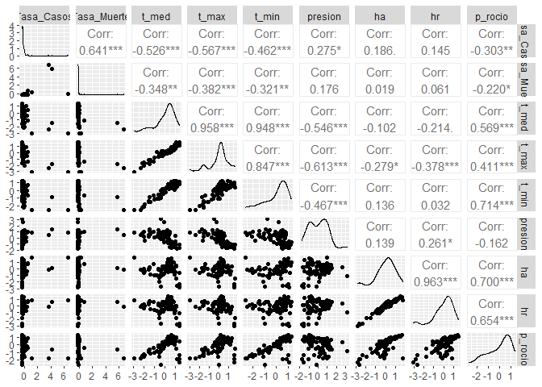
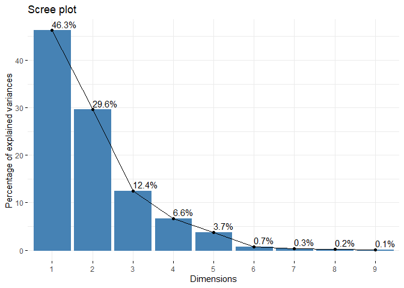
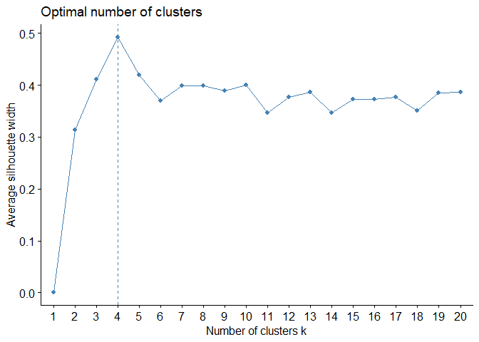
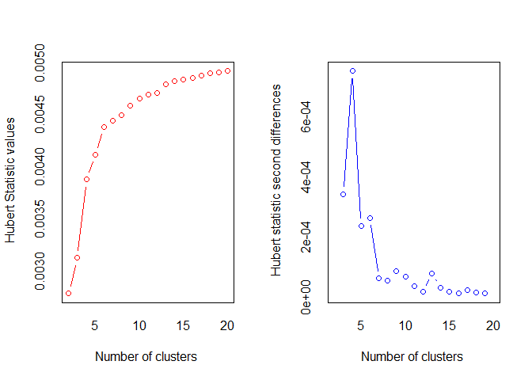

Readme
================
Grupo\_08
10/9/2021

# ANALISIS EXPLORATORIO

**Primero Cargamos las librerias**

``` r
library(PerformanceAnalytics)
library(GGally)
library(lattice)
library(cptcity)
library(psych)
library(readxl)
library(mice)
library(VIM)
library(tidyverse)
library(dplyr)
library(factoextra)
library(NbClust)
library(ade4)
library(factoextra)
library(corrplot)
library(rgl)
library(NbClust)
library(LICORS)
library(clusterSim)
library(clValid)
```

## Análisis EDA

**Leemos los datos**

``` r
data <- read_xls("Mundial.xls") %>% 
  dplyr::select(-Paises, -Casos, -Poblacion, -Death)
head(data)
```

    ## # A tibble: 6 x 10
    ##   Tasa_Casos Tasa_Muerte t_med t_max t_min presion     ha    hr   vel p_rocio
    ##        <dbl>       <dbl> <dbl> <dbl> <dbl>   <dbl>  <dbl> <dbl> <dbl>   <dbl>
    ## 1     8.56       0.529    54.9  65.1  46.5   1011. 0.164  0.642  2.73    42.4
    ## 2     1.63       0.100    71.7  85.8  55.8   1012. 0.0456 0.174  9.24    24.5
    ## 3     0.0213     0.00609  83.0  91.2  77.4   1009. 0.224  0.749  6.17    74.3
    ## 4     7.15       0        77.5  83.3  71.5   1017. 0.201  0.722  7.39    67.9
    ## 5     2.32       0.0595   72.6  89.0  60.3   1014. 0.149  0.560  9.84    55.1
    ## 6    17.7        0.0701   69.0  77.4  59.9   1017. 0.173  0.656  4.97    56.4

**Vemos si tiene Missin Value**

``` r
mice::md.pattern(data, rotate.names = TRUE)
```

    ##  /\     /\
    ## {  `---'  }
    ## {  O   O  }
    ## ==>  V <==  No need for mice. This data set is completely observed.
    ##  \  \|/  /
    ##   `-----'

<!-- -->

    ##    Tasa_Casos Tasa_Muerte t_med t_max t_min presion ha hr vel p_rocio  
    ## 82          1           1     1     1     1       1  1  1   1       1 0
    ##             0           0     0     0     0       0  0  0   0       0 0

**Estandarizamos con Scale**

``` r
scale_data <- scale(data)
```

**Hallamos su covarianza**

``` r
cor(scale_data)
```

    ##              Tasa_Casos Tasa_Muerte       t_med       t_max       t_min
    ## Tasa_Casos   1.00000000  0.64132877 -0.52590458 -0.56673453 -0.46185563
    ## Tasa_Muerte  0.64132877  1.00000000 -0.34811584 -0.38212851 -0.32081515
    ## t_med       -0.52590458 -0.34811584  1.00000000  0.95765011  0.94807794
    ## t_max       -0.56673453 -0.38212851  0.95765011  1.00000000  0.84664184
    ## t_min       -0.46185563 -0.32081515  0.94807794  0.84664184  1.00000000
    ## presion      0.27519220  0.17639821 -0.54564147 -0.61253440 -0.46687199
    ## ha           0.18638532  0.01868854 -0.10151487 -0.27872734  0.13575996
    ## hr           0.14487304  0.06069128 -0.21358017 -0.37829052  0.03248243
    ## vel          0.02939779 -0.04322323  0.08154128  0.06372092  0.07204035
    ## p_rocio     -0.30301526 -0.22036350  0.56853753  0.41109042  0.71385556
    ##                presion          ha          hr         vel    p_rocio
    ## Tasa_Casos   0.2751922  0.18638532  0.14487304  0.02939779 -0.3030153
    ## Tasa_Muerte  0.1763982  0.01868854  0.06069128 -0.04322323 -0.2203635
    ## t_med       -0.5456415 -0.10151487 -0.21358017  0.08154128  0.5685375
    ## t_max       -0.6125344 -0.27872734 -0.37829052  0.06372092  0.4110904
    ## t_min       -0.4668720  0.13575996  0.03248243  0.07204035  0.7138556
    ## presion      1.0000000  0.13880638  0.26117219  0.06052880 -0.1622819
    ## ha           0.1388064  1.00000000  0.96261925 -0.17872555  0.7001754
    ## hr           0.2611722  0.96261925  1.00000000 -0.20950248  0.6537214
    ## vel          0.0605288 -0.17872555 -0.20950248  1.00000000 -0.1370854
    ## p_rocio     -0.1622819  0.70017543  0.65372137 -0.13708542  1.0000000

**Hallamos su covarianza**

``` r
cov <- cov(scale_data)
diag(cov) %>% sum()
```

    ## [1] 10

**Justificamos las variables con grafica**

``` r
chart.Correlation(scale_data, histogram = T, pch = 20)
```

<!-- -->

``` r
ggpairs(as.data.frame(scale_data))
```

<!-- -->

``` r
mtx <- cor(scale_data)
levelplot(
  mtx,
  col.regions =
    cpt(
      pal = "cb_div_RdBu_11", n = 100, rev = F
    )
)
```

<!-- -->

## Análisis PCA

``` r
pca <-
  dudi.pca(
    scale_data,
    scale = F, scannf = F,
    nf = ncol(scale_data)
  )

summary(pca)
```

    ## Class: pca dudi
    ## Call: dudi.pca(df = scale_data, scale = F, scannf = F, nf = ncol(scale_data))
    ## 
    ## Total inertia: 9.878
    ## 
    ## Eigenvalues:
    ##     Ax1     Ax2     Ax3     Ax4     Ax5 
    ##  4.1142  2.6789  1.1069  0.9931  0.5566 
    ## 
    ## Projected inertia (%):
    ##     Ax1     Ax2     Ax3     Ax4     Ax5 
    ##  41.650  27.120  11.206  10.053   5.635 
    ## 
    ## Cumulative projected inertia (%):
    ##     Ax1   Ax1:2   Ax1:3   Ax1:4   Ax1:5 
    ##   41.65   68.77   79.98   90.03   95.66 
    ## 
    ## (Only 5 dimensions (out of 10) are shown)

**Valores Propios**

``` r
pca$eig
```

    ##  [1] 4.114157979 2.678920885 1.106908941 0.993061316 0.556589060 0.314818203
    ##  [7] 0.062234368 0.026661366 0.019070348 0.005626316

``` r
sum(pca$eig)
```

    ## [1] 9.878049

**Vectores propios**

``` r
pca$c1
```

    ##                     CS1         CS2         CS3         CS4        CS5
    ## Tasa_Casos  -0.33834874  0.06133255 -0.54305842 -0.06948640  0.1052612
    ## Tasa_Muerte -0.26040980  0.01197295 -0.70394395  0.06192812 -0.3094996
    ## t_med        0.46987864 -0.01494079 -0.19392415 -0.05913366 -0.2037818
    ## t_max        0.46288408 -0.12627481 -0.14819520  0.02447057 -0.1337969
    ## t_min        0.44792606  0.12906407 -0.20289731 -0.12041073 -0.1862444
    ## presion     -0.30299792  0.11266594  0.30839251 -0.31560596 -0.8049157
    ## ha          -0.03356071  0.59092566 -0.02001229 -0.06426010  0.2272868
    ## hr          -0.08030457  0.58932288  0.06599710 -0.04858513  0.1081580
    ## vel          0.02103273 -0.16713304 -0.07422266 -0.92853928  0.2665782
    ## p_rocio      0.28669887  0.47554939 -0.05868312 -0.06678329 -0.1292435
    ##                     CS6         CS7          CS8         CS9          CS10
    ## Tasa_Casos   0.73057997  0.10956390 -0.110708183  0.10786782  0.0359807207
    ## Tasa_Muerte -0.57064750 -0.01282205  0.090143718 -0.04512852 -0.0302620377
    ## t_med        0.12756097 -0.03776624  0.072055403 -0.33475687  0.7492717988
    ## t_max        0.10095258  0.49221534  0.531090984  0.36708669 -0.2450574218
    ## t_min        0.13390777 -0.70447223 -0.130727526  0.20402396 -0.3455774462
    ## presion      0.18509569  0.02285021  0.132211838 -0.01386446 -0.0210144927
    ## ha           0.05998225 -0.08930493  0.543752678 -0.49474947 -0.2036520666
    ## hr          -0.15864524 -0.03936416  0.065489020  0.65180076  0.4147101853
    ## vel         -0.16952144  0.06337463 -0.002314884  0.01032853  0.0003796141
    ## p_rocio     -0.06675111  0.48351278 -0.598195112 -0.16723402 -0.2073740628

**Scree Plot**

``` r
fviz_eig(pca, addlabels = T)
```

<!-- -->

**correlaciones entre variables y Componentes**

``` r
pca$co
```

    ##                   Comp1       Comp2       Comp3       Comp4       Comp5
    ## Tasa_Casos  -0.68628585  0.10038549 -0.57135035 -0.06924491  0.07853003
    ## Tasa_Muerte -0.52819927  0.01959662 -0.74061760  0.06171289 -0.23090182
    ## t_med        0.95307305 -0.02445420 -0.20402709 -0.05892815 -0.15203118
    ## t_max        0.93888570 -0.20667915 -0.15591578  0.02438553 -0.09981902
    ## t_min        0.90854578  0.21124444 -0.21346774 -0.11999226 -0.13894747
    ## presion     -0.61458242  0.18440496  0.32445896 -0.31450911 -0.60050650
    ## ha          -0.06807248  0.96719221 -0.02105487 -0.06403677  0.16956707
    ## hr          -0.16288487  0.96456888  0.06943537 -0.04841628  0.08069120
    ## vel          0.04266149 -0.27355349 -0.07808947 -0.92531226  0.19888037
    ## p_rocio      0.58152242  0.77835115 -0.06174036 -0.06655119 -0.09642201
    ##                   Comp6        Comp7         Comp8        Comp9        Comp10
    ## Tasa_Casos   0.40991865  0.027332706 -0.0180767735  0.014896053  2.698870e-03
    ## Tasa_Muerte -0.32018268 -0.003198694  0.0147189444 -0.006232043 -2.269918e-03
    ## t_med        0.07157275 -0.009421475  0.0117654284 -0.046228394  5.620196e-02
    ## t_max        0.05664314  0.122792060  0.0867181739  0.050692995 -1.838146e-02
    ## t_min        0.07513386 -0.175743398 -0.0213455937  0.028174777 -2.592134e-02
    ## presion      0.10385472  0.005700400  0.0215879567 -0.001914619 -1.576271e-03
    ## ha           0.03365524 -0.022278736  0.0887856142 -0.068322641 -1.527569e-02
    ## hr          -0.08901372 -0.009820105  0.0106932491  0.090010706  3.110690e-02
    ## vel         -0.09511621  0.015809954 -0.0003779814  0.001426323  2.847438e-05
    ## p_rocio     -0.03745315  0.120621048 -0.0976751428 -0.023094254 -1.555487e-02

**grafica de correlacione entre variables y Componentes**

``` r
levelplot(
  as.matrix(pca$co),
  col.regions =
    cpt(
      pal = "cb_div_RdBu_11", n = 100, rev = F
    )
)
```

<!-- -->

**Contribucion de las variables a los componentes**

``` r
contrib <- as.matrix(pca$co * pca$co)
head(contrib)
```

    ##                 Comp1        Comp2      Comp3        Comp4       Comp5
    ## Tasa_Casos  0.4709883 0.0100772466 0.32644122 0.0047948574 0.006166965
    ## Tasa_Muerte 0.2789945 0.0003840274 0.54851443 0.0038084810 0.053315652
    ## t_med       0.9083482 0.0005980078 0.04162705 0.0034725269 0.023113478
    ## t_max       0.8815063 0.0427162721 0.02430973 0.0005946539 0.009963838
    ## t_min       0.8254554 0.0446242147 0.04556847 0.0143981426 0.019306401
    ## presion     0.3777115 0.0340051894 0.10527362 0.0989159783 0.360608060
    ##                   Comp6        Comp7        Comp8        Comp9       Comp10
    ## Tasa_Casos  0.168033300 7.470768e-04 0.0003267697 2.218924e-04 7.283898e-06
    ## Tasa_Muerte 0.102516949 1.023164e-05 0.0002166473 3.883836e-05 5.152529e-06
    ## t_med       0.005122659 8.876419e-05 0.0001384253 2.137064e-03 3.158660e-03
    ## t_max       0.003208445 1.507789e-02 0.0075200417 2.569780e-03 3.378779e-04
    ## t_min       0.005645097 3.088574e-02 0.0004556344 7.938181e-04 6.719159e-04
    ## presion     0.010785802 3.249456e-05 0.0004660399 3.665765e-06 2.484631e-06

**Contribucion de las variables a los componentes**

``` r
corrplot(contrib, is.corr = F)
```

<!-- -->

**Obteniendo los Score O Puntuaciones**

``` r
as.tibble(scale_data)
```

    ## # A tibble: 82 x 10
    ##    Tasa_Casos Tasa_Muerte   t_med   t_max    t_min presion     ha      hr
    ##         <dbl>       <dbl>   <dbl>   <dbl>    <dbl>   <dbl>  <dbl>   <dbl>
    ##  1    -0.141      -0.0242 -1.91   -1.72   -1.79     -0.480 -0.298  0.0975
    ##  2    -0.295      -0.166  -0.403   0.0361 -0.962    -0.207 -2.65  -2.67  
    ##  3    -0.331      -0.197   0.617   0.492   0.964    -1.11   0.882  0.729 
    ##  4    -0.172      -0.199   0.121  -0.178   0.436     1.23   0.441  0.572 
    ##  5    -0.280      -0.180  -0.317   0.309  -0.560     0.456 -0.606 -0.387 
    ##  6     0.0639     -0.176  -0.645  -0.676  -0.592     1.26  -0.120  0.178 
    ##  7    -0.252      -0.199  -0.0952 -0.237   0.214     2.63   0.269  0.480 
    ##  8     0.411      -0.121  -0.387  -0.560   0.00973   0.977 -0.350 -0.0778
    ##  9    -0.331      -0.198   0.294   0.380   0.232    -0.680 -0.455 -0.451 
    ## 10    -0.0680     -0.199   0.322   0.0215  0.718     0.658  0.324  0.338 
    ## # ... with 72 more rows, and 2 more variables: vel <dbl>, p_rocio <dbl>

``` r
head(pca$li)
```

    ##          Axis1      Axis2      Axis3      Axis4       Axis5       Axis6
    ## 1 -2.696500965 -0.6618496  1.0883127  1.3380031  1.22138267 -0.63509990
    ## 2 -0.850573794 -4.6166526  0.4927432  0.4222049 -0.02552431  0.05597213
    ## 3  1.645551046  1.3788595 -0.4218498  0.2880144  0.63056788 -0.16593036
    ## 4  0.001098813  1.0629008  0.5272025 -0.5147931 -0.94457290  0.17642764
    ## 5 -0.309821983 -0.9196242  0.5292169 -0.3269644 -0.23444064 -0.11713210
    ## 6 -1.347220040  0.1274068  0.8901906  0.1221132 -0.71306774  0.21339908
    ##         Axis7       Axis8       Axis9       Axis10
    ## 1 -0.21848868 -0.21989410  0.06289494 -0.009394019
    ## 2 -0.24979796  0.08017141 -0.04770281  0.006885341
    ## 3 -0.15226849 -0.02604941  0.02651750 -0.061584131
    ## 4 -0.19031375 -0.02505466  0.02093238 -0.007404634
    ## 5  0.43922906  0.17576671  0.19589303 -0.087312481
    ## 6 -0.02635579 -0.05355601  0.06651847  0.029616511

``` r
dim(pca$li)
```

    ## [1] 82 10

``` r
result <-
  as.tibble(pca$li) %>%
  dplyr::select(sprintf("Axis%1$s", 1:4))
```

## Análisis Claster

**calculo de las distancias**

``` r
distancia <- dist(scale(result), method = "euclidean")
as.matrix(distancia) %>% dim()
```

    ## [1] 82 82

``` r
cluster::daisy(result, metric = "euclidean")
```

    ## Dissimilarities :
    ##             1          2          3          4          5          6          7
    ## 2   4.4990336                                                                  
    ## 3   5.1381880  6.5598240                                                       
    ## 4   3.7415915  5.8190914  2.0854863                                            
    ## 5   2.9744561  3.8109075  3.2232341  2.0155299                                 
    ## 6   1.9902575  4.7959124  3.5031109  1.7973655  1.5825427                      
    ## 7   3.6069339  5.7650286  3.1865859  1.1365681  2.1105529  1.6896917           
    ## 8   2.8256800  4.5401279  3.1981883  1.5596053  0.9861585  1.1078721  1.4695176
    ## 9   3.7044115  4.6056226  2.2488534  2.5153070  2.0718371  2.6720438  3.3523337
    ## 10  4.5708015  5.7541632  2.2775969  1.2575243  2.1423787  2.6315893  1.5997706
    ## 11  4.3995583  6.5416318  1.6011253  0.9948578  2.8056630  2.5797811  1.9431554
    ## 12  5.2788276  5.2655234  2.0084573  3.1720678  2.9784337  3.9754347  4.0806911
    ## 13  4.7043273  6.4135863  0.5325393  1.8185581  3.0171153  3.1185030  2.9459447
    ## 14  4.3513818  6.4893706  1.1142658  1.7507429  3.0577925  2.8602033  2.8529242
    ## 15  6.3426559  3.6752748  5.3506784  5.8550471  4.4501741  5.8218198  6.3817796
    ## 16  4.7788513  5.4339927  1.3163329  2.4175395  2.5926054  3.3454666  3.4033635
    ## 17  3.7181635  5.5560812  2.0766344  0.4125969  1.7639724  1.7829769  1.2400491
    ## 18  4.9782587  5.8585891  1.1934177  2.6937206  3.0731574  3.6338569  3.7589506
    ## 19  6.3204461  3.1847309  5.8799525  6.1857775  4.6045781  5.9687132  6.6166492
    ## 20  2.0049196  3.2610263  3.9751001  2.9100710  1.3350696  1.6797288  3.0263520
    ## 21  1.2420105  4.9632749  4.4913899  2.7864938  2.4667188  1.0833353  2.4723112
    ## 22  3.6887215  3.8709871  3.1118498  2.2290925  0.8127660  2.2706199  2.4206742
    ## 23  4.9310884  5.8942932  0.7896097  2.2351733  2.8204311  3.3941525  3.2912022
    ## 24  3.7857867  5.5537945  1.4771295  0.8964004  1.9302147  2.0420442  1.9643949
    ## 25  4.2402048  6.1029522  1.5097263  0.6655147  2.3590306  2.3579532  1.7188106
    ## 26  3.4340419  5.6726689  1.7617028  1.0575583  2.1190967  1.8182134  2.0571739
    ## 27  3.0048034  1.6792342  5.2204175  4.3663267  2.4436045  3.2270750  4.3862930
    ## 28  3.7797820  4.6712442  2.0920461  1.4994899  1.1977892  2.1281798  2.1472591
    ## 29  5.5000915  7.5192791  1.1309191  2.3739582  3.9937016  3.8750725  3.4026742
    ## 30  2.2888135  3.7492100  4.7725880  3.0617122  1.7794872  1.7327853  2.5118068
    ## 31  2.8941662  5.0500680  2.3719187  1.2317465  1.5486826  1.2724183  1.8726996
    ## 32  5.0553534  7.3197512  1.2994783  2.2526489  3.8282481  3.5486525  3.2966026
    ## 33  6.9055494  4.6973187  5.2836613  5.2219416  4.1497279  5.6704131  5.3401828
    ## 34  5.4443955  6.3610423  0.9339362  2.8053168  3.4544709  3.9838485  3.8865991
    ## 35  1.0563932  4.9280501  5.8072276  4.1380252  3.4780346  2.3827948  3.7185139
    ## 36  4.5299626  6.1444915  1.5724224  0.8793745  2.4224081  2.6051792  1.7536714
    ## 37  1.9944221  5.0024579  3.3880046  1.7991006  1.8189961  0.4592655  1.8467854
    ## 38  4.7203411  4.2663285  2.7432272  3.3203663  2.4890202  3.6629124  4.0627330
    ## 39  4.4409667  6.5635444  1.2871578  1.0876976  2.8629453  2.6635442  2.1426689
    ## 40  3.6575722  4.9063392  1.8326573  1.9319785  1.8675300  2.3431837  2.8285126
    ## 41  5.9041356  8.8830240  8.8999191  7.4251717  7.4466578  6.4360409  6.9910282
    ## 42  4.3332306  4.7242036  2.2563265  2.9511971  2.5021578  3.3000336  3.8300830
    ## 43  5.0944521  6.9476651  0.8319336  2.3667561  3.6337894  3.6182126  3.4819679
    ## 44  1.8017514  3.2992580  4.3764043  2.9974289  1.4348411  1.5428661  2.8421772
    ## 45  3.5250909  7.1645430  7.2052911  5.3718103  5.3668713  4.0978985  4.7265099
    ## 46  7.5359369  9.2559418 10.0172067  9.2130305  8.8177867  8.2806682  9.1865969
    ## 47  4.1900205  5.6281529  1.7022408  0.7780585  1.9176524  2.2831337  1.6318250
    ## 48  1.2007928  4.7685667  5.3025109  3.5379075  2.9042310  1.8103558  3.0483281
    ## 49  2.5193521  2.6587079  4.2407575  3.3210391  1.4779997  2.2637704  3.4260135
    ## 50  4.7916112  5.7695958  1.1997693  2.5753356  2.9467587  3.4634471  3.6405972
    ## 51  1.7113022  4.5344948  4.7156520  2.8726409  2.1829104  1.2646827  2.3108140
    ## 52  5.0511718  7.1927381  1.0839401  2.1836478  3.7136544  3.5164019  3.2569310
    ## 53  5.3773505  6.7638604  0.4342016  2.0865716  3.3518778  3.6514722  3.1333513
    ## 54  1.2654634  4.5986265  6.0788850  4.4118137  3.5340032  2.6362466  3.9566221
    ## 55  3.8354843  5.6954955  1.8235960  0.3601778  1.9225755  1.9266011  1.4100802
    ## 56  1.9600256  5.4867217  4.7754004  2.8566244  2.8358755  1.4678412  2.2539840
    ## 57  6.7282955  3.4024906  6.3148551  6.6486084  5.0596646  6.4231107  7.0723476
    ## 58  3.1762050  3.3397325  3.3268213  2.5542521  0.7405493  2.1328175  2.8222180
    ## 59  5.5990170  5.1231398  3.1755555  3.1457652  2.7492776  4.0061519  3.4884758
    ## 60  5.3484686  7.1127516  0.6575996  2.1640552  3.6359347  3.6865357  3.2352849
    ## 61  4.4142131  4.8044897  1.9743670  2.6731999  2.3225826  3.2009813  3.5596882
    ## 62  4.7673913  6.7415371  0.7862077  1.9139266  3.2962939  3.2130932  3.0299574
    ## 63  7.3854338  7.8244428  5.1150283  4.4159218  5.0174485  5.5604867  4.1136603
    ## 64  2.7142484  3.4267047  3.5053076  2.4540897  0.6322460  1.7162382  2.6011579
    ## 65  4.1874141  6.0931391  2.2486617  0.6146094  2.3009040  2.2140166  1.0823091
    ## 66  4.1605178  5.8058837  1.6386053  0.6087192  2.0621061  2.2478337  1.5846380
    ## 67  4.8926797  5.9596370  2.5089362  1.5753826  2.4325082  2.9482094  1.7606386
    ## 68  8.2422147  4.9640638  7.3931053  7.2065037  5.8303405  7.3448254  7.1860457
    ## 69  5.2326502  6.7185825  0.2500543  2.0743036  3.3246921  3.5622566  3.1620177
    ## 70  4.8853603  6.2445937  0.5097498  1.6803143  2.8071018  3.1591013  2.7489421
    ## 71  5.0521523  5.8416790  1.7366799  1.7204821  2.4406124  3.1815807  2.3802417
    ## 72  7.0138401  9.0569504  8.5247301  7.8360065  7.8099362  7.2606457  7.8810025
    ## 73  4.3543250  6.2055185  1.0498887  1.0693100  2.5701430  2.5855820  2.1863026
    ## 74  2.6874591  5.1856028  2.5296273  1.2162556  1.6866104  1.0326007  1.7906551
    ## 75  5.3452506  6.1049410  1.2258410  2.9292255  3.3662574  3.9687928  3.9938062
    ## 76  5.1772014  7.1304995  0.8584241  2.2462206  3.6960363  3.6206392  3.3367397
    ## 77  3.9850262  5.6555000  1.3426491  0.9043852  2.0251037  2.2112060  1.9888038
    ## 78  1.7266422  3.6923689  4.9973332  3.3307667  2.0587697  1.7330171  2.8692728
    ## 79  3.0987516  3.9242166  2.7971387  2.0170396  0.6827469  1.7988932  2.4485658
    ## 80  2.7175153  5.7750055  4.2087462  2.4135252  2.7509717  1.6592482  1.9979675
    ## 81  3.0310492  4.6161845  2.4386487  1.2781757  0.9479045  1.3473546  1.8069850
    ## 82  5.5767571  5.0853534  2.4884638  3.5027855  3.0934702  4.2746399  4.3119470
    ##             8          9         10         11         12         13         14
    ## 2                                                                              
    ## 3                                                                              
    ## 4                                                                              
    ## 5                                                                              
    ## 6                                                                              
    ## 7                                                                              
    ## 8                                                                              
    ## 9   2.5655217                                                                  
    ## 10  1.8411459  2.9370513                                                       
    ## 11  2.3148600  2.8078647  1.5441361                                            
    ## 12  3.4772370  1.6815136  2.9964353  3.1693130                                 
    ## 13  2.9586865  2.0212903  2.3015123  1.4260166  2.1978617                      
    ## 14  2.8977235  2.1048597  2.5320240  1.3857189  2.6576270  0.6066575           
    ## 15  5.3071518  3.8673999  5.5401012  6.1856180  3.3796053  5.4425715  5.7738226
    ## 16  2.9420333  1.3018987  2.4512501  2.3993431  0.8377723  1.4056904  1.8480108
    ## 17  1.3143716  2.3752861  1.0315411  1.0923201  2.9686054  1.8659700  1.8731491
    ## 18  3.3471969  1.4856715  2.8719200  2.5102814  1.0937557  1.2764099  1.6859499
    ## 19  5.4783507  4.2459835  5.8868305  6.5919718  3.9587210  5.9353536  6.2298842
    ## 20  1.8176732  2.2049068  3.3744947  3.6401017  3.5719153  3.6643260  3.5522676
    ## 21  2.0683445  3.5031242  3.6646310  3.5183843  4.9548782  4.0629010  3.7161290
    ## 22  1.3690309  2.2158108  1.9042496  2.8491225  2.6448656  3.0375670  3.2157562
    ## 23  3.0041557  1.6654315  2.2973013  2.0298855  1.2491125  0.9777286  1.5044476
    ## 24  1.8002706  1.7122063  1.5811015  1.1631363  2.3837751  1.1716908  1.1988397
    ## 25  1.9984207  2.4565714  1.1746281  0.5538955  2.8196485  1.3402595  1.4156558
    ## 26  1.8646610  1.8001317  2.0366086  1.2566060  2.7637568  1.3329203  1.0739940
    ## 27  3.1573933  3.2126799  4.5513093  5.1075908  4.2476747  4.9919587  4.9827940
    ## 28  1.5728665  1.4995496  1.5600396  2.0622952  2.0390446  1.9588378  2.1564156
    ## 29  3.7532615  3.1448933  2.7990629  1.6140158  3.1180837  1.1360075  1.2357543
    ## 30  1.8554125  3.5671737  3.3996542  3.9891912  4.7144986  4.4737106  4.3549429
    ## 31  1.4969140  1.6693013  2.1805338  1.9079400  2.9124723  1.9666868  1.7740365
    ## 32  3.5838129  2.8957053  2.9321240  1.6082791  3.1764987  1.0427516  0.8415194
    ## 33  4.6883970  4.8536201  4.2322375  5.5627001  4.0356461  5.5200341  5.9659474
    ## 34  3.6583275  2.0402573  2.8885161  2.4789282  1.3522129  1.2174521  1.7334902
    ## 35  3.1848866  4.5715943  4.9167591  4.8497732  6.0809545  5.3793646  5.0215888
    ## 36  2.1075444  2.6417608  0.8692135  0.8051781  2.7962677  1.5302979  1.7277310
    ## 37  1.4708112  2.5568762  2.7915013  2.5455522  3.9444059  2.9588379  2.6443606
    ## 38  3.1990027  1.3918468  3.2144009  3.5759700  1.0275466  2.7793043  3.1088235
    ## 39  2.5206756  2.5780930  1.7869449  0.5499271  2.9658798  1.0185430  0.9624367
    ## 40  2.2022008  0.6000680  2.4209953  2.2282933  1.7780542  1.5606888  1.6385895
    ## 41  6.6664596  8.5230087  7.8422152  7.5681384  9.6084547  8.6077501  8.2503235
    ## 42  3.0627898  0.6706129  3.1697008  3.1333597  1.1435867  2.1681091  2.3945826
    ## 43  3.5568842  2.4254497  2.8964466  1.8376105  2.5298602  0.6508003  0.7844167
    ## 44  1.7137549  2.8235864  3.4280131  3.8108888  4.1186682  4.0627839  3.9306525
    ## 45  4.6617799  6.6249638  6.0365625  5.8346743  7.9485942  6.8166644  6.4156155
    ## 46  8.2968938  9.3455753  9.4692618  9.1860828 10.1855388  9.8172195  9.5549966
    ## 47  1.7609230  2.2462951  0.8600729  1.1958896  2.5467091  1.5963164  1.7897885
    ## 48  2.5552460  4.1846656  4.2601966  4.2951590  5.6139802  4.8980190  4.5796053
    ## 49  2.1867075  2.3498235  3.5971533  4.0537267  3.5283597  3.9879308  3.9583912
    ## 50  3.2119352  1.3326017  2.8214081  2.4250184  1.1871643  1.2031723  1.5662188
    ## 51  1.7719041  3.7312731  3.4556169  3.6863259  5.0117699  4.3598720  4.1194293
    ## 52  3.4830343  2.7751400  2.7868165  1.5046300  2.9818014  0.8690471  0.7725081
    ## 53  3.2697713  2.5982335  2.1128352  1.5217756  2.2244202  0.8665494  1.3970102
    ## 54  3.3235955  4.7321360  5.0988208  5.1593474  6.2113627  5.6706103  5.3489545
    ## 55  1.6385101  2.2315264  1.2212397  1.0418366  2.8306227  1.5700547  1.5807114
    ## 56  2.2099325  4.1236282  3.6393130  3.5607359  5.4313215  4.3787059  4.0440088
    ## 57  5.9361981  4.6949898  6.3355298  7.0520493  4.3728148  6.3787702  6.6786413
    ## 58  1.6342945  1.7758533  2.6080466  3.2258944  2.6417708  3.1581806  3.2518990
    ## 59  2.9805353  3.3213698  2.0942542  3.2961631  2.5921065  3.4209667  3.8546825
    ## 60  3.4566653  2.7913361  2.4573025  1.4496228  2.6565537  0.8025857  1.1201516
    ## 61  2.8428998  0.8075053  2.7732389  2.8349847  0.8851633  1.9446566  2.2474150
    ## 62  3.1357005  2.3339575  2.5061251  1.3679125  2.5878811  0.4280796  0.4507547
    ## 63  4.6760793  6.1587298  3.3387339  4.4325794  5.6885752  5.3351848  5.6400539
    ## 64  1.2523567  2.0578235  2.6226089  3.1502961  3.0792085  3.2885817  3.2955466
    ## 65  1.7642207  2.9851015  0.8888315  1.0060883  3.3937255  2.1056840  2.1350978
    ## 66  1.8063204  2.3191809  0.9599164  0.9482648  2.6804031  1.4916921  1.6279866
    ## 67  2.1358075  3.2866340  0.3872975  1.7956973  3.2233759  2.5822959  2.8406099
    ## 68  6.4214675  6.6515502  6.2732776  7.6330320  5.9658332  7.5984674  8.0130957
    ## 69  3.2354140  2.4581671  2.2270115  1.4884534  2.1973945  0.6580599  1.1789224
    ## 70  2.7684397  2.1394721  1.7812130  1.3288716  1.9841182  0.6858285  1.2128592
    ## 71  2.4477990  2.6423741  0.9294413  1.7730804  2.2734403  1.9239758  2.3492701
    ## 72  7.1617544  8.2872309  8.0180351  7.6431531  8.9541017  8.3769750  8.1437224
    ## 73  2.3736544  2.1730722  1.6663263  0.8363498  2.5332544  0.7731170  0.8918872
    ## 74  1.3713981  1.9560428  2.2394908  1.8199151  3.2031815  2.1138826  1.8418448
    ## 75  3.6503780  1.8178538  3.0211130  2.6913781  1.0857621  1.4252529  1.8933864
    ## 76  3.5376679  2.6813014  2.7595200  1.6172013  2.7608604  0.7270676  0.8318378
    ## 77  1.8980814  1.8133061  1.4531766  1.0786094  2.3234056  1.0943978  1.2101893
    ## 78  2.0127133  3.6733115  3.7629478  4.1795101  4.9401988  4.6703497  4.4935994
    ## 79  1.3605173  1.4077301  2.2397156  2.6583007  2.4197933  2.5877771  2.6496543
    ## 80  1.8198899  3.9630562  2.9846039  2.8365341  5.0094996  3.8971476  3.6179974
    ## 81  1.0243380  1.6266195  1.8097235  1.9924659  2.6626974  2.1569554  2.1296308
    ## 82  3.6673846  2.1073460  3.1362671  3.5599474  0.6130506  2.7201302  3.2031379
    ##            15         16         17         18         19         20         21
    ## 2                                                                              
    ## 3                                                                              
    ## 4                                                                              
    ## 5                                                                              
    ## 6                                                                              
    ## 7                                                                              
    ## 8                                                                              
    ## 9                                                                              
    ## 10                                                                             
    ## 11                                                                             
    ## 12                                                                             
    ## 13                                                                             
    ## 14                                                                             
    ## 15                                                                             
    ## 16  4.0574783                                                                  
    ## 17  5.5700932  2.2627186                                                       
    ## 18  4.3346024  0.6048454  2.5902591                                            
    ## 19  0.7245898  4.5758648  5.8938608  4.8838064                                 
    ## 20  4.4767106  3.2416930  2.7378383  3.5850546  4.5138133                      
    ## 21  6.5167357  4.3410694  2.8287632  4.5848818  6.5792945  2.0710673           
    ## 22  4.0933213  2.4027147  1.8841591  2.9440337  4.2916140  1.9604985  3.2045464
    ## 23  4.5632640  0.5382319  2.1205627  0.6152555  5.0911999  3.5348838  4.4048590
    ## 24  5.1994269  1.5967896  0.8388666  1.8381866  5.5801947  2.6917659  3.0661103
    ## 25  5.7524412  2.0580090  0.6982094  2.2789819  6.1473468  3.2849650  3.3680038
    ## 26  5.4988685  1.9697084  1.1050122  2.0842294  5.8552713  2.6190505  2.7486089
    ## 27  3.8033492  4.2112156  4.1479692  4.6007795  3.5938541  1.6247162  3.4156294
    ## 28  4.3686336  1.5121661  1.2581926  2.0188339  4.7019828  2.2133371  3.1709634
    ## 29  6.4654899  2.4208552  2.5145041  2.1941185  6.9924097  4.6904214  4.7538165
    ## 30  5.6593442  4.2944563  2.9638596  4.7296442  5.6249541  1.7473345  1.7924360
    ## 31  5.2395029  2.2049831  1.2571394  2.4512834  5.5206814  1.9590757  2.2113762
    ## 32  6.4391490  2.4218454  2.4303065  2.1632390  6.9367138  4.3790431  4.3582816
    ## 33  3.6817677  4.4433807  4.8878472  4.9707848  3.8318239  5.0324407  6.5366876
    ## 34  4.7003619  0.9486620  2.7354508  0.5872485  5.2835158  4.0859342  4.9608374
    ## 35  7.1375860  5.5465081  4.1437336  5.7906383  7.0740228  2.7382132  1.3755492
    ## 36  5.7163577  2.0940743  0.8405073  2.3733024  6.1198399  3.4711942  3.6342040
    ## 37  5.8998179  3.2771453  1.8620139  3.5122741  6.0715324  1.8045505  1.1232077
    ## 38  2.6807300  1.4305556  3.0810785  1.7970256  3.1591674  2.8710562  4.5526957
    ## 39  6.0695701  2.1560415  1.2692111  2.2124417  6.4993653  3.6383313  3.5920674
    ## 40  4.3115780  1.1472074  1.8124659  1.3902346  4.6952936  2.2602952  3.2652894
    ## 41 10.9221070  9.0752861  7.3612284  9.2225363 10.8803427  7.1682838  5.9347329
    ## 42  3.4325756  1.0743069  2.7859914  1.2325996  3.8936589  2.7267306  4.1583845
    ## 43  5.8108183  1.8259844  2.4598214  1.4926889  6.3355961  4.1797260  4.4936423
    ## 44  4.9745190  3.7504781  2.8408755  4.1300970  4.9576439  0.7136382  1.7421256
    ## 45  9.3951280  7.3193728  5.4136370  7.5311906  9.3612449  5.0503723  3.3071448
    ## 46 10.7684892  9.9179456  9.0166489  9.9725161 10.6812303  8.3242022  8.0248547
    ## 47  5.2977027  1.8595096  0.6388674  2.2342973  5.6725251  2.9925427  3.3417244
    ## 48  6.8168317  5.0644264  3.5348305  5.3489610  6.7887369  2.3788839  0.8966935
    ## 49  3.9667587  3.3429139  3.1100439  3.7340152  3.9467559  0.6584662  2.6629969
    ## 50  4.3634784  0.6058076  2.4773624  0.1945577  4.8932151  3.4266399  4.4036549
    ## 51  6.3399078  4.4699130  2.8272128  4.8143090  6.3524241  2.0183443  0.9423169
    ## 52  6.2609144  2.2359340  2.3239962  1.9840301  6.7636228  4.2977088  4.3650276
    ## 53  5.5597979  1.5904431  2.0788726  1.5536487  6.0917561  4.2121092  4.6598474
    ## 54  7.0324678  5.7285140  4.3838223  6.0050952  6.9197418  2.7459157  1.7220981
    ## 55  5.5619835  2.0752328  0.4544215  2.3704186  5.9142228  2.8429128  2.9503386
    ## 56  7.1241482  4.7828826  2.9219966  5.0523615  7.1897930  2.7530128  0.8878422
    ## 57  1.0272551  5.0116582  6.3572256  5.3072876  0.4666311  4.9491178  7.0157112
    ## 58  3.7494513  2.4311639  2.2811229  2.9095999  3.8979340  1.2363405  2.9308270
    ## 59  4.2106783  2.6660976  2.7984803  3.1772187  4.5690963  3.8924224  5.0238443
    ## 60  6.0034355  1.9689826  2.2359645  1.7935534  6.5305406  4.3844830  4.6282397
    ## 61  3.5284468  0.7181095  2.4822454  1.0611764  4.0013164  2.7634593  4.1327246
    ## 62  5.8323153  1.8113209  2.0134384  1.6114725  6.3231497  3.8918456  4.1072311
    ## 63  7.6520146  5.4234434  4.2837881  5.8349073  7.9479842  6.3041915  6.3884753
    ## 64  4.2354313  2.7726027  2.1821159  3.2082115  4.3409886  0.9378729  2.4624295
    ## 65  6.0942550  2.6900712  0.6701709  2.9945073  6.4321139  3.3401342  3.1795458
    ## 66  5.4994101  1.9519448  0.5507319  2.2666750  5.8781746  3.0738045  3.2900755
    ## 67  5.7227518  2.7252881  1.3932414  3.1498806  6.0704784  3.6994359  3.9560128
    ## 68  4.4315191  6.4454370  6.8666140  6.9623531  4.2845019  6.4550044  8.0542168
    ## 69  5.5383296  1.5256968  2.0710741  1.4177320  6.0666935  4.1110862  4.5522718
    ## 70  5.2308353  1.2507996  1.6342266  1.3605410  5.7250075  3.6672342  4.1847830
    ## 71  5.0509203  1.8143500  1.5300240  2.2456308  5.4843231  3.6312307  4.2548045
    ## 72 10.0921468  8.6304862  7.6487538  8.6597268 10.1356800  7.5906259  7.2080914
    ## 73  5.6174779  1.7188149  1.1616108  1.8331323  6.0519007  3.3675247  3.5673452
    ## 74  5.5223839  2.4863739  1.2362994  2.6935431  5.7865504  2.0064331  1.9675334
    ## 75  4.3819054  0.7959584  2.8353432  0.3743990  4.9654486  3.9268433  4.9312764
    ## 76  6.0727587  2.0381401  2.3661749  1.7750295  6.5923276  4.3148797  4.5018949
    ## 77  5.2112634  1.5376933  0.8359178  1.7927994  5.6081895  2.8568314  3.2455087
    ## 78  5.7965921  4.5193982  3.2172359  4.9055955  5.7317105  1.6269636  1.5238537
    ## 79  4.1009666  2.0369772  1.7629401  2.4819468  4.3263881  1.3529886  2.7193443
    ## 80  6.9720150  4.3662605  2.3739417  4.6156193  7.1088498  3.0031370  1.8483323
    ## 81  4.8170833  2.0601451  1.0811198  2.4407302  5.0796699  1.7245569  2.3940188
    ## 82  2.9963557  1.3618677  3.2638513  1.6952001  3.5895020  3.7537995  5.2613654
    ##            22         23         24         25         26         27         28
    ## 2                                                                              
    ## 3                                                                              
    ## 4                                                                              
    ## 5                                                                              
    ## 6                                                                              
    ## 7                                                                              
    ## 8                                                                              
    ## 9                                                                              
    ## 10                                                                             
    ## 11                                                                             
    ## 12                                                                             
    ## 13                                                                             
    ## 14                                                                             
    ## 15                                                                             
    ## 16                                                                             
    ## 17                                                                             
    ## 18                                                                             
    ## 19                                                                             
    ## 20                                                                             
    ## 21                                                                             
    ## 22                                                                             
    ## 23  2.6416885                                                                  
    ## 24  2.0688258  1.4534781                                                       
    ## 25  2.3901456  1.7657786  0.7715319                                            
    ## 26  2.4062762  1.8225348  0.5917802  1.0881728                                 
    ## 27  2.7527868  4.6281412  4.0969711  4.6945026  4.1333436                      
    ## 28  1.1756419  1.6803380  1.0674309  1.5489080  1.5117154  3.3460515           
    ## 29  3.9917289  1.9090898  2.0749641  1.8390735  2.1380589  6.0863000  2.9642174
    ## 30  2.4096634  4.4889702  3.3325384  3.6352623  3.3260139  2.4784877  2.8653585
    ## 31  2.0634332  2.2387721  0.9936899  1.5806672  0.8390889  3.4743995  1.2912119
    ## 32  3.9377849  1.9708923  1.9095395  1.8304109  1.8211480  5.8219606  2.8806434
    ## 33  3.4302007  4.7241990  5.0217188  5.1273103  5.5269017  4.7900837  4.1072273
    ## 34  3.2763298  0.6658739  2.0375210  2.2999091  2.3282636  5.1260846  2.3179509
    ## 35  4.1865529  5.6631669  4.3861529  4.7113177  4.0620997  3.5914750  4.3785083
    ## 36  2.3466999  1.8038088  1.0489309  0.4145042  1.4687138  4.8040049  1.5724561
    ## 37  2.5270350  3.3127632  1.9722189  2.3432323  1.6681201  3.3823821  2.1861733
    ## 38  2.2198802  1.9589711  2.5767059  3.1566022  2.8982096  3.2957632  1.9187457
    ## 39  2.9599498  1.7730199  1.0196176  0.6506328  1.1149876  5.0979330  1.9974500
    ## 40  2.0291887  1.3656424  1.1160501  1.8650718  1.2565279  3.4665499  1.0974068
    ## 41  7.7413439  8.9885125  7.8259836  7.7567871  7.4891735  7.9859094  8.1226511
    ## 42  2.4608724  1.5482655  2.1077086  2.7786014  2.2994053  3.4978113  1.8015950
    ## 43  3.6733832  1.3902940  1.7821026  1.8914730  1.8127030  5.5109339  2.5926124
    ## 44  2.1034499  4.0007447  2.9887067  3.4676454  2.9176534  1.7705429  2.5219715
    ## 45  5.9071132  7.2788304  5.8909516  5.8993414  5.5438608  6.0051984  6.1338252
    ## 46  8.9067659  9.9197907  9.2309891  9.3457018  8.9265611  8.7403530  9.4001654
    ## 47  1.8881346  1.7064224  0.7932097  0.6482985  1.3123584  4.2838113  1.0431700
    ## 48  3.6047408  5.1669891  3.8502297  4.1309584  3.5783851  3.3843022  3.8120817
    ## 49  1.9251020  3.7073448  3.0521690  3.6506585  3.0773439  1.0633175  2.3727952
    ## 50  2.8589746  0.6383719  1.7049781  2.1896997  1.9228834  4.4775746  1.9153251
    ## 51  2.8404137  4.5660370  3.2419696  3.4713139  3.0713566  3.1457506  3.1151623
    ## 52  3.7809793  1.7680166  1.7902177  1.7107525  1.7493956  5.7195113  2.7398109
    ## 53  3.1854810  1.0702164  1.6322334  1.4614166  1.9707895  5.4558273  2.2192108
    ## 54  4.2155236  5.8815626  4.6413657  4.9852416  4.3600328  3.3759503  4.5246194
    ## 55  2.0903139  1.9111673  0.6172101  0.5684981  0.9476412  4.2562617  1.2213979
    ## 56  3.4855783  4.7811962  3.3587246  3.4682723  3.0844115  4.0416289  3.5206530
    ## 57  4.7449005  5.5257297  6.0419607  6.6069862  6.3180795  3.9594725  5.1623941
    ## 58  0.9111006  2.7760902  2.2270807  2.7735365  2.4269230  2.0183042  1.3683432
    ## 59  1.9747772  2.7689306  2.9602847  2.9267887  3.4770700  4.4327697  2.3181436
    ## 60  3.5710142  1.4434670  1.7606369  1.5696345  1.9269475  5.7254989  2.5644494
    ## 61  2.1865980  1.2249363  1.8446152  2.4584519  2.1310635  3.5952029  1.4894618
    ## 62  3.3574431  1.3704791  1.3906279  1.4427448  1.4081888  5.2826275  2.3016719
    ## 63  4.5631544  5.2382447  4.8981200  4.3216644  5.3216333  7.1075330  4.7462273
    ## 64  1.0553426  3.0449358  2.2559856  2.7549501  2.3508651  2.0200765  1.5963643
    ## 65  2.3576819  2.4605466  1.3447011  0.7773516  1.5962818  4.7264805  1.7970412
    ## 66  2.0819475  1.7444622  0.7158239  0.3994675  1.1709559  4.4259380  1.2311727
    ## 67  2.1419735  2.5589526  1.9470932  1.4802694  2.4051470  4.8190715  1.8891733
    ## 68  5.2076290  6.7839625  7.0254745  7.1881857  7.4881698  5.7228963  6.0450092
    ## 69  3.1969453  0.9924468  1.5490608  1.4611441  1.8253811  5.3805304  2.2102926
    ## 70  2.6771665  0.7993273  1.1237011  1.1068754  1.5348312  4.9156556  1.6763498
    ## 71  2.0795494  1.6543388  1.5942971  1.3630417  2.1652984  4.6943161  1.4745837
    ## 72  7.8185210  8.5386218  7.8964869  7.8791650  7.6214410  8.3129201  8.1962484
    ## 73  2.6363351  1.3792113  0.6841877  0.6076898  0.9664564  4.7658956  1.6041657
    ## 74  2.2016857  2.4689665  1.1362526  1.6005416  0.8061536  3.5961005  1.5842208
    ## 75  3.1901952  0.7379087  2.1105800  2.4726320  2.3904432  4.8955166  2.2722672
    ## 76  3.7269467  1.5600669  1.7875567  1.7424114  1.8298046  5.6874176  2.6611819
    ## 77  2.0944040  1.3522011  0.2119131  0.6474127  0.7698265  4.2293692  1.0829863
    ## 78  2.6922614  4.7124707  3.5426021  3.8856100  3.4395255  2.3801729  3.1740601
    ## 79  0.9893979  2.3143668  1.6303112  2.2188134  1.8141359  2.5102143  0.9079721
    ## 80  3.1395007  4.2780574  2.9305482  2.8661474  2.6934739  4.3891214  3.2293305
    ## 81  1.3591742  2.1653553  1.0406973  1.5771700  1.1734988  3.1362052  0.8082235
    ## 82  2.6425263  1.7526785  2.7900342  3.1753523  3.2208987  4.2371966  2.2571180
    ##            29         30         31         32         33         34         35
    ## 2                                                                              
    ## 3                                                                              
    ## 4                                                                              
    ## 5                                                                              
    ## 6                                                                              
    ## 7                                                                              
    ## 8                                                                              
    ## 9                                                                              
    ## 10                                                                             
    ## 11                                                                             
    ## 12                                                                             
    ## 13                                                                             
    ## 14                                                                             
    ## 15                                                                             
    ## 16                                                                             
    ## 17                                                                             
    ## 18                                                                             
    ## 19                                                                             
    ## 20                                                                             
    ## 21                                                                             
    ## 22                                                                             
    ## 23                                                                             
    ## 24                                                                             
    ## 25                                                                             
    ## 26                                                                             
    ## 27                                                                             
    ## 28                                                                             
    ## 29                                                                             
    ## 30  5.3309968                                                                  
    ## 31  2.8658079  2.6063066                                                       
    ## 32  0.6124542  5.0798164  2.5438515                                            
    ## 33  6.2889615  5.2456373  5.3418851  6.4966873                                 
    ## 34  1.8843989  5.1111239  2.7857301  1.9939660  5.0907101                      
    ## 35  6.0888041  2.2959479  3.5136706  5.6707393  7.3210112  6.2149385           
    ## 36  1.9635426  3.7321944  1.8671218  2.0676435  4.8643443  2.3378385  4.9677132
    ## 37  3.7039930  2.0247038  1.1011636  3.3266334  5.9338671  3.8613854  2.4662790
    ## 38  3.8435407  4.1237504  2.7782304  3.7888539  3.7689706  2.2333601  5.5394766
    ## 39  1.2915324  4.0838568  1.7758455  1.2132304  5.6696521  2.1635429  4.9487386
    ## 40  2.6867975  3.3976944  1.2171478  2.4506491  4.8588156  1.8584850  4.4460869
    ## 41  8.8474006  6.7834386  7.4831395  8.5803120 10.2979744  9.5081071  5.4126879
    ## 42  3.2577564  4.0907167  2.2698001  3.0975525  4.6116228  1.7859415  5.2089445
    ## 43  0.8659668  5.0469246  2.4774021  0.7133227  6.0645759  1.3117404  5.7943915
    ## 44  5.0238626  1.1063646  2.2242756  4.7261190  5.1498087  4.5917374  2.2887288
    ## 45  7.1865150  4.2654814  5.2868093  6.8386467  8.8891233  7.8407586  2.7005723
    ## 46 10.1940988  8.6963172  9.0233693  9.9502040 10.8795286 10.3225569  7.5548145
    ## 47  2.2970711  3.2989920  1.4864298  2.3110580  4.5852733  2.3109305  4.6610693
    ## 48  5.6080417  1.7160084  3.0128497  5.2321683  6.7559915  5.7465606  0.7074628
    ## 49  5.0608658  1.9421145  2.4259852  4.7938343  4.6290806  4.2441086  3.1979299
    ## 50  2.1803198  4.5817298  2.2799995  2.1018508  5.0195439  0.7347873  5.6068904
    ## 51  5.0903504  1.1158107  2.4959065  4.7844154  5.9777144  5.1812125  1.5746953
    ## 52  0.5264153  5.0264197  2.4951028  0.2506160  6.2889211  1.8056504  5.6794738
    ## 53  1.0909390  4.8853914  2.5828255  1.4298313  5.2133705  1.2191094  5.9924059
    ## 54  6.4304831  2.2222956  3.7698145  6.0302227  7.2118658  6.4470772  0.5110886
    ## 55  2.2490590  3.1367559  1.1309511  2.1420704  5.0308565  2.4903730  4.2994859
    ## 56  4.9310964  1.9939549  2.6583754  4.5923743  6.7150149  5.3624479  1.6402748
    ## 57  7.4284949  6.0379297  5.9815780  7.3779291  4.0761152  5.6962596  7.4755358
    ## 58  4.2241520  2.2179123  1.9064713  4.0576363  3.9020831  3.3585302  3.8163923
    ## 59  4.0882843  4.2450619  3.5259765  4.3170763  2.3486078  3.2346089  6.0683572
    ## 60  0.5081777  5.0712590  2.6383369  0.8734096  5.7989330  1.4866101  5.9626703
    ## 61  3.0339010  3.9998771  2.1555546  2.9372611  4.3252172  1.5703791  5.2376095
    ## 62  0.8465222  4.6694525  2.1282052  0.6381828  5.9040352  1.5142043  5.4236907
    ## 63  5.3608903  5.7275549  5.4656453  5.7308654  4.7011027  5.6617926  7.4092218
    ## 64  4.3013883  1.8604259  1.8188123  4.0987044  4.2602045  3.6547701  3.3144335
    ## 65  2.4757059  3.3099535  1.8218726  2.4898310  5.0831541  3.0223040  4.4946676
    ## 66  2.1265385  3.3810869  1.4553086  2.1207687  4.8266959  2.3268182  4.6261215
    ## 67  2.9827352  3.6105398  2.5463673  3.1721651  4.1632368  3.1178834  5.1899608
    ## 68  8.4241597  6.5499850  7.1964639  8.5974978  2.1665501  7.1393103  8.5785518
    ## 69  0.9919131  4.8547865  2.4775917  1.2490347  5.3454359  1.1290942  5.8752054
    ## 70  1.4147209  4.3551250  2.0769404  1.5585287  4.9412270  1.2316575  5.5075551
    ## 71  2.4893905  3.9565341  2.3896461  2.7148250  3.9573012  2.1748888  5.5312213
    ## 72  8.5889947  7.9563650  7.8746917  8.4210810  9.8279091  8.9179315  7.0921105
    ## 73  1.4442264  3.9185023  1.5583220  1.3715226  5.3208097  1.8364605  4.9181901
    ## 74  2.9165175  2.5978996  0.4755544  2.5731875  5.5562828  3.0188961  3.2805364
    ## 75  2.2032665  5.0376577  2.7725152  2.2510069  4.9823461  0.3610646  6.1496863
    ## 76  0.5068304  5.0702139  2.5352533  0.4785780  6.1201105  1.5441223  5.8238828
    ## 77  1.9698577  3.4586878  1.1876915  1.8642821  4.9377900  1.9413608  4.5695857
    ## 78  5.5296661  0.7383834  2.7709655  5.2333192  5.6211603  5.3272575  1.7434768
    ## 79  3.6437095  2.3454175  1.3401723  3.4568970  4.2259004  2.9175395  3.7689659
    ## 80  4.3370332  2.6451622  2.6037964  4.0952888  6.2692636  4.8688529  2.6890633
    ## 81  3.1134017  2.3715649  0.7155824  2.9029418  4.6878355  2.7921272  3.6223574
    ## 82  3.6070542  4.8204550  3.2960945  3.7145740  3.5016766  1.8780657  6.3479010
    ##            36         37         38         39         40         41         42
    ## 2                                                                              
    ## 3                                                                              
    ## 4                                                                              
    ## 5                                                                              
    ## 6                                                                              
    ## 7                                                                              
    ## 8                                                                              
    ## 9                                                                              
    ## 10                                                                             
    ## 11                                                                             
    ## 12                                                                             
    ## 13                                                                             
    ## 14                                                                             
    ## 15                                                                             
    ## 16                                                                             
    ## 17                                                                             
    ## 18                                                                             
    ## 19                                                                             
    ## 20                                                                             
    ## 21                                                                             
    ## 22                                                                             
    ## 23                                                                             
    ## 24                                                                             
    ## 25                                                                             
    ## 26                                                                             
    ## 27                                                                             
    ## 28                                                                             
    ## 29                                                                             
    ## 30                                                                             
    ## 31                                                                             
    ## 32                                                                             
    ## 33                                                                             
    ## 34                                                                             
    ## 35                                                                             
    ## 36                                                                             
    ## 37  2.6319156                                                                  
    ## 38  3.1706163  3.6671613                                                       
    ## 39  0.9345675  2.5471523  3.4088514                                            
    ## 40  2.0653090  2.2285050  1.7129749  2.0001712                                 
    ## 41  7.9606367  6.6544009  9.3564592  7.9634958  8.2822197                      
    ## 42  2.8975931  3.2075401  0.9243261  2.8891921  1.0843879  9.0650750           
    ## 43  2.0860373  3.4113845  3.1978142  1.4155922  2.0528547  8.9099192  2.5141894
    ## 44  3.6302477  1.7802650  3.4480319  3.8701968  2.7808539  6.7877542  3.3559566
    ## 45  6.1240261  4.2506293  7.6102649  6.1035560  6.3455198  3.3200464  7.2611814
    ## 46  9.5579849  8.4964271  9.8871767  9.5519133  9.3190799  4.2468333  9.6995386
    ## 47  0.5634780  2.3186792  2.7728226  1.2064209  1.6832273  7.9865025  2.5369526
    ## 48  4.3597829  1.9671514  5.1104955  4.4158832  4.0009336  5.5537609  4.8182500
    ## 49  3.7832554  2.4125231  2.6975671  4.0447255  2.5028892  7.5914150  2.7478378
    ## 50  2.3113164  3.3338701  1.7882509  2.1228860  1.2202376  9.0756541  1.1515867
    ## 51  3.6501872  1.5769716  4.5482431  3.8421376  3.4872378  5.8474483  4.3353023
    ## 52  1.9329161  3.3190050  3.6158942  1.1319236  2.3288636  8.5617986  2.9514405
    ## 53  1.4299285  3.5675314  2.9896665  1.2815499  2.1519024  8.9440332  2.5982384
    ## 54  5.2183403  2.7682810  5.6039964  5.2674407  4.6434706  5.4972537  5.3462803
    ## 55  0.7704008  1.9050026  2.9999236  1.0133744  1.6421638  7.7043618  2.6329346
    ## 56  3.6908281  1.6237402  5.1098852  3.7254033  3.7968951  5.4967423  4.7618549
    ## 57  6.5747226  6.5254950  3.6009933  6.9561067  5.1512513 11.2665026  4.3302922
    ## 58  2.8375474  2.3055003  1.9588614  3.2309991  1.7858351  7.8318904  2.1025972
    ## 59  2.6555580  4.2351031  2.6916970  3.4622096  3.1142497  8.8493971  3.2029808
    ## 60  1.6579759  3.5522134  3.3926207  1.1468492  2.3353261  8.8053135  2.8655011
    ## 61  2.5359204  3.1452899  0.8671683  2.6221575  0.9763148  8.9715524  0.4504509
    ## 62  1.6777409  3.0298661  3.1741390  0.9565510  1.8762534  8.4921143  2.5194556
    ## 63  3.9574715  5.8244220  5.9905733  4.7654364  5.7010130  9.0102141  6.2433444
    ## 64  2.8615986  1.9624622  2.4678715  3.2230058  1.9932930  7.2372045  2.4895894
    ## 65  0.7294052  2.2956707  3.6147593  1.2825086  2.4045600  7.4412527  3.3506537
    ## 66  0.4306703  2.2602612  2.9408073  0.9739636  1.7352817  7.8698368  2.6375333
    ## 67  1.1285038  3.1218431  3.4725578  2.0498769  2.7793874  7.9931572  3.4842079
    ## 68  6.9479523  7.6410840  5.5175302  7.7514680  6.7506711 11.4122618  6.4115618
    ## 69  1.5051732  3.4599028  2.9426224  1.2194465  2.0211911  8.8333281  2.4803216
    ## 70  1.1181502  3.0880021  2.6077370  1.0833773  1.6541170  8.6516054  2.2126524
    ## 71  1.0282943  3.2626457  2.6879474  1.8112503  2.1837944  8.6329584  2.6953684
    ## 72  8.0655485  7.4775768  8.8439885  8.0530290  8.1616726  3.8651867  8.6211344
    ## 73  0.8582677  2.4769527  2.9547817  0.4660424  1.5952045  8.1455973  2.4568035
    ## 74  1.9287170  0.8853459  3.0864660  1.7900894  1.5170087  7.0362233  2.5685165
    ## 75  2.5240808  3.8477276  1.9399904  2.3816358  1.7338548  9.5484857  1.4852362
    ## 76  1.9208308  3.4287350  3.4405192  1.2116785  2.2524149  8.8061220  2.8003017
    ## 77  0.8802616  2.1572301  2.5824649  0.9352773  1.2207991  7.9400334  2.1519223
    ## 78  4.0356588  2.0329945  4.3196776  4.3017291  3.5503637  6.2454484  4.2283233
    ## 79  2.3292839  1.9131807  1.9322039  2.6408240  1.2671727  7.7137558  1.8435635
    ## 80  3.0671198  1.9408370  4.8488061  3.1781330  3.5680440  5.0710552  4.5338043
    ## 81  1.7540938  1.4154332  2.4418582  1.9886232  1.2116231  7.4362836  2.1493633
    ## 82  3.0901210  4.2914609  1.0404962  3.4027646  2.2261557  9.8646746  1.5695900
    ##            43         44         45         46         47         48         49
    ## 2                                                                              
    ## 3                                                                              
    ## 4                                                                              
    ## 5                                                                              
    ## 6                                                                              
    ## 7                                                                              
    ## 8                                                                              
    ## 9                                                                              
    ## 10                                                                             
    ## 11                                                                             
    ## 12                                                                             
    ## 13                                                                             
    ## 14                                                                             
    ## 15                                                                             
    ## 16                                                                             
    ## 17                                                                             
    ## 18                                                                             
    ## 19                                                                             
    ## 20                                                                             
    ## 21                                                                             
    ## 22                                                                             
    ## 23                                                                             
    ## 24                                                                             
    ## 25                                                                             
    ## 26                                                                             
    ## 27                                                                             
    ## 28                                                                             
    ## 29                                                                             
    ## 30                                                                             
    ## 31                                                                             
    ## 32                                                                             
    ## 33                                                                             
    ## 34                                                                             
    ## 35                                                                             
    ## 36                                                                             
    ## 37                                                                             
    ## 38                                                                             
    ## 39                                                                             
    ## 40                                                                             
    ## 41                                                                             
    ## 42                                                                             
    ## 43                                                                             
    ## 44  4.6053155                                                                  
    ## 45  7.1775039  4.5474812                                                       
    ## 46 10.0564506  8.2142802  6.7340758                                            
    ## 47  2.2218117  3.1699739  6.0321150  9.5414044                                 
    ## 48  5.3540750  1.8581043  2.8353188  7.7511330  4.0515287                      
    ## 49  4.5207543  1.0399209  5.5387497  8.5760350  3.2726469  2.8579391           
    ## 50  1.4526532  3.9728333  7.3594504  9.8579024  2.1523456  5.1713118  3.5961501
    ## 51  4.8759430  1.4438791  3.3000211  7.9733956  3.3287184  0.8785762  2.4740379
    ## 52  0.5823078  4.6548751  6.8656220  9.8665615  2.1811430  5.2288362  4.6938312
    ## 53  1.1261595  4.5657484  7.2801451 10.1383040  1.6685166  5.4575364  4.4710724
    ## 54  6.1139398  2.2434638  2.8763717  7.5405741  4.8814315  0.9305467  3.1187284
    ## 55  2.1573736  3.0017157  5.6627998  9.3670728  0.5189241  3.7096474  3.2134964
    ## 56  4.8212523  2.3056692  2.7606152  7.9845131  3.4835098  1.0804182  3.2998996
    ## 57  6.7678768  5.3824367  9.7742325 10.9732503  6.1293501  7.2050340  4.3725666
    ## 58  3.7460056  1.5978372  5.8734002  8.8705323  2.3225038  3.3274628  1.1183550
    ## 59  3.9768951  4.0668013  7.4267193  9.7412477  2.4941398  5.4547235  3.7787373
    ## 60  0.7651650  4.7361382  7.1577806 10.0552143  1.9548909  5.4618910  4.7133349
    ## 61  2.3627628  3.3395607  7.1906530  9.6871436  2.1853120  4.7978102  2.7929567
    ## 62  0.4854763  4.2693813  6.7429905  9.7510226  1.8369610  4.9609329  4.2633555
    ## 63  5.7923076  6.1428086  7.7241599 10.9009041  4.1556150  6.7147395  6.3843267
    ## 64  3.8739524  1.1681683  5.2983023  8.3767375  2.3869356  2.8180426  1.0452539
    ## 65  2.6403097  3.3623700  5.5002993  9.3027779  0.8832135  3.8604776  3.7065383
    ## 66  2.0957037  3.2464949  5.9297240  9.4627008  0.2620212  4.0256576  3.3971852
    ## 67  3.1531404  3.7176699  6.2156731  9.6750556  1.1990367  4.5193512  3.8948706
    ## 68  8.1486230  6.4979404 10.1593820 11.6894535  6.6283091  8.0879693  5.9311468
    ## 69  0.8969403  4.4869415  7.1843038  9.9835407  1.7163719  5.3615232  4.3901921
    ## 70  1.2301793  4.0199609  6.9020122  9.8727322  1.2112055  4.9686873  3.9247929
    ## 71  2.4926641  3.8377181  6.8574765  9.9964077  0.9872557  4.9051987  3.7707114
    ## 72  8.5828125  7.5133385  6.1818994  2.2031217  8.1531605  7.1206401  7.9102161
    ## 73  1.3337708  3.6499459  6.2537604  9.6139874  0.9477728  4.3817168  3.7266810
    ## 74  2.5952624  2.2061541  4.9119219  8.6195228  1.6395718  2.7857009  2.5436269
    ## 75  1.5547835  4.4667180  7.8717346 10.2749164  2.4252833  5.6986596  4.0503989
    ## 76  0.3776731  4.6935891  7.0863405 10.0627691  2.1420356  5.3624400  4.6754330
    ## 77  1.7247210  3.1457528  6.0321902  9.3431438  0.6613640  4.0213753  3.1922533
    ## 78  5.2145725  0.9253701  3.8322381  8.0506116  3.6304463  1.2439108  1.9077782
    ## 79  3.1761510  1.7490035  5.7340113  8.8538079  1.8239876  3.2606769  1.5034965
    ## 80  4.3446785  2.7031992  3.1389519  7.2993157  3.0065515  2.1690768  3.5324969
    ## 81  2.7538759  1.9721943  5.3775915  8.8514208  1.2863422  3.0689947  2.0835400
    ## 82  3.0855592  4.2677718  8.2319670 10.3814101  2.8195158  5.8622495  3.6133101
    ##            50         51         52         53         54         55         56
    ## 2                                                                              
    ## 3                                                                              
    ## 4                                                                              
    ## 5                                                                              
    ## 6                                                                              
    ## 7                                                                              
    ## 8                                                                              
    ## 9                                                                              
    ## 10                                                                             
    ## 11                                                                             
    ## 12                                                                             
    ## 13                                                                             
    ## 14                                                                             
    ## 15                                                                             
    ## 16                                                                             
    ## 17                                                                             
    ## 18                                                                             
    ## 19                                                                             
    ## 20                                                                             
    ## 21                                                                             
    ## 22                                                                             
    ## 23                                                                             
    ## 24                                                                             
    ## 25                                                                             
    ## 26                                                                             
    ## 27                                                                             
    ## 28                                                                             
    ## 29                                                                             
    ## 30                                                                             
    ## 31                                                                             
    ## 32                                                                             
    ## 33                                                                             
    ## 34                                                                             
    ## 35                                                                             
    ## 36                                                                             
    ## 37                                                                             
    ## 38                                                                             
    ## 39                                                                             
    ## 40                                                                             
    ## 41                                                                             
    ## 42                                                                             
    ## 43                                                                             
    ## 44                                                                             
    ## 45                                                                             
    ## 46                                                                             
    ## 47                                                                             
    ## 48                                                                             
    ## 49                                                                             
    ## 50                                                                             
    ## 51  4.6492628                                                                  
    ## 52  1.9300384  4.7546743                                                       
    ## 53  1.5817373  4.8311485  1.2188156                                            
    ## 54  5.8253286  1.6907546  6.0252159  6.2628682                                 
    ## 55  2.2556644  3.0427118  2.0534497  1.8528516  4.5573386                      
    ## 56  4.8816644  0.9738278  4.6032759  4.8716286  1.9721477  3.1031486           
    ## 57  5.3221430  6.7821545  7.2047773  6.5249453  7.3068443  6.3755459  7.6296809
    ## 58  2.7944779  2.7077476  3.9248527  3.5077640  3.8265082  2.3885945  3.4238711
    ## 59  3.2106128  4.6359888  4.1019040  3.0566252  6.1089927  2.9674380  5.1500193
    ## 60  1.7900539  4.9002189  0.6657737  0.6085090  6.2737226  1.9883468  4.8331465
    ## 61  0.9977501  4.2483294  2.7707749  2.2742940  5.3776889  2.3450125  4.6682914
    ## 62  1.5383636  4.4611372  0.4631062  1.0292436  5.7448174  1.7314348  4.3908704
    ## 63  5.8538383  5.8742002  5.5945415  4.7620016  7.5066492  4.4853901  6.0074977
    ## 64  3.0751970  2.1989837  3.9773282  3.6772319  3.3312441  2.3662759  2.9304724
    ## 65  2.9059198  3.1371748  2.4028145  2.1311183  4.7514065  0.8112548  3.1057956
    ## 66  2.1776354  3.3274235  2.0001806  1.6034545  4.8702989  0.3804860  3.4133145
    ## 67  3.1154201  3.6970122  3.0285635  2.2910097  5.3621333  1.5621757  3.8713295
    ## 68  7.0026702  7.3934496  8.3922777  7.3516866  8.3583659  7.0348255  8.2392489
    ## 69  1.4283448  4.7652503  1.0227408  0.2778530  6.1540020  1.8416172  4.7946757
    ## 70  1.3386052  4.3346141  1.3578882  0.5533212  5.7608833  1.4021192  4.4322377
    ## 71  2.2455985  4.1294488  2.5360347  1.5545338  5.7078426  1.4970301  4.3692962
    ## 72  8.5617875  7.1687331  8.3307107  8.5868578  7.1792476  8.0048387  7.0768118
    ## 73  1.7396612  3.7842249  1.2495385  1.1228354  5.2064945  0.8477933  3.7802606
    ## 74  2.5198299  2.2953097  2.5292095  2.7228694  3.5661619  1.2305487  2.3698641
    ## 75  0.5608977  5.1482886  2.0704291  1.5362423  6.3635676  2.6018142  5.3809429
    ## 76  1.7406107  4.8645499  0.3098101  1.0158201  6.1542124  2.0730404  4.7620477
    ## 77  1.6772408  3.3909560  1.7307341  1.4606799  4.8209424  0.5989751  3.5064176
    ## 78  4.7464079  0.8749300  5.1811042  5.1417967  1.6270576  3.4235985  1.8230862
    ## 79  2.3491712  2.6353274  3.3302715  2.9910358  3.8607236  1.8369683  3.2053906
    ## 80  4.4659695  1.7427674  4.0579170  4.2453285  2.9658692  2.6986445  1.4319641
    ## 81  2.2923906  2.4196272  2.8000569  2.6008979  3.8031901  1.1447025  2.7790864
    ## 82  1.7904598  5.2208192  3.5133160  2.6340321  6.4370771  3.1673094  5.7151188
    ##            57         58         59         60         61         62         63
    ## 2                                                                              
    ## 3                                                                              
    ## 4                                                                              
    ## 5                                                                              
    ## 6                                                                              
    ## 7                                                                              
    ## 8                                                                              
    ## 9                                                                              
    ## 10                                                                             
    ## 11                                                                             
    ## 12                                                                             
    ## 13                                                                             
    ## 14                                                                             
    ## 15                                                                             
    ## 16                                                                             
    ## 17                                                                             
    ## 18                                                                             
    ## 19                                                                             
    ## 20                                                                             
    ## 21                                                                             
    ## 22                                                                             
    ## 23                                                                             
    ## 24                                                                             
    ## 25                                                                             
    ## 26                                                                             
    ## 27                                                                             
    ## 28                                                                             
    ## 29                                                                             
    ## 30                                                                             
    ## 31                                                                             
    ## 32                                                                             
    ## 33                                                                             
    ## 34                                                                             
    ## 35                                                                             
    ## 36                                                                             
    ## 37                                                                             
    ## 38                                                                             
    ## 39                                                                             
    ## 40                                                                             
    ## 41                                                                             
    ## 42                                                                             
    ## 43                                                                             
    ## 44                                                                             
    ## 45                                                                             
    ## 46                                                                             
    ## 47                                                                             
    ## 48                                                                             
    ## 49                                                                             
    ## 50                                                                             
    ## 51                                                                             
    ## 52                                                                             
    ## 53                                                                             
    ## 54                                                                             
    ## 55                                                                             
    ## 56                                                                             
    ## 57                                                                             
    ## 58  4.3556997                                                                  
    ## 59  4.9678197  2.7287451                                                       
    ## 60  6.9668684  3.8284306  3.6086796                                            
    ## 61  4.4451533  1.9884296  2.7919932  2.6054482                                 
    ## 62  6.7670573  3.4786720  3.7540821  0.6795839  2.3268501                      
    ## 63  8.3218666  5.4543160  3.5401704  5.1170806  5.8036172  5.4714590           
    ## 64  4.7941851  0.6017333  2.9843224  3.9376959  2.3815444  3.5558954  5.4581996
    ## 65  6.8911903  2.8677644  2.9519966  2.2617848  3.0188174  2.1884134  3.8333406
    ## 66  6.3367714  2.4863935  2.6968184  1.8175280  2.3025448  1.6815970  4.2252082
    ## 67  6.5115068  2.8989904  2.0662267  2.6542442  3.0747705  2.7780016  2.9657483
    ## 68  4.3233304  5.5137614  4.4579561  7.9303864  6.2044104  7.9893958  6.3449239
    ## 69  6.5022818  3.4634221  3.1870268  0.4874836  2.1853378  0.8020942  4.9795139
    ## 70  6.1684318  2.9676199  2.7984753  0.9463788  1.8729424  1.0045566  4.7255058
    ## 71  5.9220435  2.6892634  1.8081025  2.0634514  2.2642986  2.2222232  3.6520277
    ## 72 10.4775445  7.9448417  8.4009724  8.4784547  8.5380016  8.2716494  9.2633974
    ## 73  6.5070616  2.8739374  3.1687383  1.1630966  2.1768364  0.9133683  4.7956179
    ## 74  6.2497182  2.0970398  3.6708048  2.7201521  2.4528178  2.2052256  5.4739847
    ## 75  5.3760508  3.1988659  3.2284458  1.8078769  1.3102622  1.7450939  5.8489218
    ## 76  7.0287083  3.8728599  3.9708468  0.5067066  2.6099616  0.4332705  5.5576638
    ## 77  6.0682476  2.3194006  2.8425033  1.6317299  1.8565747  1.3342727  4.7475154
    ## 78  6.1417916  2.4036501  4.5771147  5.2816745  4.1787368  4.8346664  6.1667334
    ## 79  4.7901942  0.6146242  2.7264823  3.2672122  1.6931957  2.8896980  5.3199541
    ## 80  7.5616170  3.3387221  4.4568722  4.2107412  4.3581766  3.8774380  5.2223638
    ## 81  5.5442293  1.3464184  2.9073934  2.7931111  1.9530439  2.3949913  5.0491907
    ## 82  3.9908709  2.7063112  2.3218614  3.1285769  1.3189926  3.1206208  5.5674659
    ##            64         65         66         67         68         69         70
    ## 2                                                                              
    ## 3                                                                              
    ## 4                                                                              
    ## 5                                                                              
    ## 6                                                                              
    ## 7                                                                              
    ## 8                                                                              
    ## 9                                                                              
    ## 10                                                                             
    ## 11                                                                             
    ## 12                                                                             
    ## 13                                                                             
    ## 14                                                                             
    ## 15                                                                             
    ## 16                                                                             
    ## 17                                                                             
    ## 18                                                                             
    ## 19                                                                             
    ## 20                                                                             
    ## 21                                                                             
    ## 22                                                                             
    ## 23                                                                             
    ## 24                                                                             
    ## 25                                                                             
    ## 26                                                                             
    ## 27                                                                             
    ## 28                                                                             
    ## 29                                                                             
    ## 30                                                                             
    ## 31                                                                             
    ## 32                                                                             
    ## 33                                                                             
    ## 34                                                                             
    ## 35                                                                             
    ## 36                                                                             
    ## 37                                                                             
    ## 38                                                                             
    ## 39                                                                             
    ## 40                                                                             
    ## 41                                                                             
    ## 42                                                                             
    ## 43                                                                             
    ## 44                                                                             
    ## 45                                                                             
    ## 46                                                                             
    ## 47                                                                             
    ## 48                                                                             
    ## 49                                                                             
    ## 50                                                                             
    ## 51                                                                             
    ## 52                                                                             
    ## 53                                                                             
    ## 54                                                                             
    ## 55                                                                             
    ## 56                                                                             
    ## 57                                                                             
    ## 58                                                                             
    ## 59                                                                             
    ## 60                                                                             
    ## 61                                                                             
    ## 62                                                                             
    ## 63                                                                             
    ## 64                                                                             
    ## 65  2.7687849                                                                  
    ## 66  2.5083704  0.7514209                                                       
    ## 67  2.9257632  1.1166901  1.2934738                                            
    ## 68  5.8270568  7.0929030  6.8724370  6.2061794                                 
    ## 69  3.6165403  2.1821539  1.6320242  2.4392834  7.4690837                      
    ## 70  3.1349340  1.8124572  1.1732347  2.0255237  7.0527010  0.5549226           
    ## 71  2.8858537  1.5499645  1.1515501  1.0308388  6.0850382  1.7219004  1.2728937
    ## 72  7.4654767  7.8411364  8.0491342  8.1911783 10.9263799  8.4497484  8.3989336
    ## 73  2.9298316  1.3463865  0.7788123  1.9627737  7.3945125  1.0584723  0.7560232
    ## 74  1.8808207  1.7827246  1.5578854  2.6077434  7.3999983  2.6019270  2.2441148
    ## 75  3.5252066  3.1850690  2.4636209  3.2669163  6.9880560  1.4372355  1.4555048
    ## 76  3.9716595  2.4577754  1.9898502  2.9926738  8.2282301  0.8238045  1.1992557
    ## 77  2.3744551  1.2724605  0.5853933  1.8074493  6.9680142  1.4016328  0.9497497
    ## 78  1.9307016  3.6164580  3.6830106  4.0065839  6.8694970  5.0780240  4.6113555
    ## 79  0.7772311  2.3887497  1.9584253  2.5738402  5.9707939  2.9295214  2.4430788
    ## 80  2.8214185  2.4987584  2.9028543  3.2027675  7.9154550  4.1736258  3.8651932
    ## 81  1.2718423  1.7221062  1.3515073  2.1760295  6.5313955  2.5354108  2.0578688
    ## 82  3.1929959  3.6626204  2.9907905  3.3161412  5.4072287  2.6536128  2.4018407
    ##            71         72         73         74         75         76         77
    ## 2                                                                              
    ## 3                                                                              
    ## 4                                                                              
    ## 5                                                                              
    ## 6                                                                              
    ## 7                                                                              
    ## 8                                                                              
    ## 9                                                                              
    ## 10                                                                             
    ## 11                                                                             
    ## 12                                                                             
    ## 13                                                                             
    ## 14                                                                             
    ## 15                                                                             
    ## 16                                                                             
    ## 17                                                                             
    ## 18                                                                             
    ## 19                                                                             
    ## 20                                                                             
    ## 21                                                                             
    ## 22                                                                             
    ## 23                                                                             
    ## 24                                                                             
    ## 25                                                                             
    ## 26                                                                             
    ## 27                                                                             
    ## 28                                                                             
    ## 29                                                                             
    ## 30                                                                             
    ## 31                                                                             
    ## 32                                                                             
    ## 33                                                                             
    ## 34                                                                             
    ## 35                                                                             
    ## 36                                                                             
    ## 37                                                                             
    ## 38                                                                             
    ## 39                                                                             
    ## 40                                                                             
    ## 41                                                                             
    ## 42                                                                             
    ## 43                                                                             
    ## 44                                                                             
    ## 45                                                                             
    ## 46                                                                             
    ## 47                                                                             
    ## 48                                                                             
    ## 49                                                                             
    ## 50                                                                             
    ## 51                                                                             
    ## 52                                                                             
    ## 53                                                                             
    ## 54                                                                             
    ## 55                                                                             
    ## 56                                                                             
    ## 57                                                                             
    ## 58                                                                             
    ## 59                                                                             
    ## 60                                                                             
    ## 61                                                                             
    ## 62                                                                             
    ## 63                                                                             
    ## 64                                                                             
    ## 65                                                                             
    ## 66                                                                             
    ## 67                                                                             
    ## 68                                                                             
    ## 69                                                                             
    ## 70                                                                             
    ## 71                                                                             
    ## 72  8.5378077                                                                  
    ## 73  1.5451026  8.1709327                                                       
    ## 74  2.5729709  7.4504424  1.6694105                                            
    ## 75  2.3118291  8.9302454  2.0187765  3.0256784                                 
    ## 76  2.4102265  8.5366356  1.2348880  2.6208759  1.8252141                      
    ## 77  1.4082782  7.9764791  0.5629794  1.3340696  2.0387265  1.7083899           
    ## 78  4.3347937  7.4076516  4.1574435  2.6682720  5.2399338  5.2526438  3.6922150
    ## 79  2.3239233  7.8232932  2.2907308  1.5444923  2.7927821  3.2921728  1.7389184
    ## 80  3.7780845  6.0957844  3.2912614  2.1979358  4.9293249  4.2382909  3.0392120
    ## 81  2.0526782  7.7026633  1.7078667  0.8823892  2.7551327  2.8060217  1.1800866
    ## 82  2.3951034  9.1754656  2.9674629  3.5950332  1.6502704  3.2875253  2.7173605
    ##            78         79         80         81
    ## 2                                             
    ## 3                                             
    ## 4                                             
    ## 5                                             
    ## 6                                             
    ## 7                                             
    ## 8                                             
    ## 9                                             
    ## 10                                            
    ## 11                                            
    ## 12                                            
    ## 13                                            
    ## 14                                            
    ## 15                                            
    ## 16                                            
    ## 17                                            
    ## 18                                            
    ## 19                                            
    ## 20                                            
    ## 21                                            
    ## 22                                            
    ## 23                                            
    ## 24                                            
    ## 25                                            
    ## 26                                            
    ## 27                                            
    ## 28                                            
    ## 29                                            
    ## 30                                            
    ## 31                                            
    ## 32                                            
    ## 33                                            
    ## 34                                            
    ## 35                                            
    ## 36                                            
    ## 37                                            
    ## 38                                            
    ## 39                                            
    ## 40                                            
    ## 41                                            
    ## 42                                            
    ## 43                                            
    ## 44                                            
    ## 45                                            
    ## 46                                            
    ## 47                                            
    ## 48                                            
    ## 49                                            
    ## 50                                            
    ## 51                                            
    ## 52                                            
    ## 53                                            
    ## 54                                            
    ## 55                                            
    ## 56                                            
    ## 57                                            
    ## 58                                            
    ## 59                                            
    ## 60                                            
    ## 61                                            
    ## 62                                            
    ## 63                                            
    ## 64                                            
    ## 65                                            
    ## 66                                            
    ## 67                                            
    ## 68                                            
    ## 69                                            
    ## 70                                            
    ## 71                                            
    ## 72                                            
    ## 73                                            
    ## 74                                            
    ## 75                                            
    ## 76                                            
    ## 77                                            
    ## 78                                            
    ## 79  2.5244114                                 
    ## 80  2.4685812  3.0440439                      
    ## 81  2.5724791  0.7789280  2.5529266           
    ## 82  5.0807984  2.6058664  5.2887979  2.9472479
    ## 
    ## Metric :  euclidean 
    ## Number of objects : 82

**metodo jerarquico, mediante enlace ward**

``` r
hmodel <- hclust(distancia, method = "ward.D")
plot(hmodel)
```

<!-- -->

**proceso de agrupamiento indicando distancias**

``` r
hmodel$height
```

    ##  [1]  0.1219610  0.1619464  0.1630967  0.1666141  0.2039506  0.2211974
    ##  [7]  0.2615974  0.2689057  0.2835770  0.2838028  0.2870262  0.2960258
    ## [13]  0.3090078  0.3215239  0.3397136  0.3422331  0.3463085  0.3496000
    ## [19]  0.3624218  0.3702579  0.3974649  0.4024512  0.4040739  0.4053387
    ## [25]  0.4439323  0.4572044  0.4582286  0.4616340  0.4674277  0.4856269
    ## [31]  0.5162481  0.5243557  0.5295308  0.5405934  0.5482276  0.6055630
    ## [37]  0.6312090  0.6349068  0.6693273  0.6839082  0.7001134  0.7698963
    ## [43]  0.7700333  0.7749808  0.7966546  0.8425161  0.8594677  0.9553634
    ## [49]  0.9565539  0.9699364  1.0240436  1.0553364  1.0721573  1.0879044
    ## [55]  1.1037779  1.3419078  1.4092753  1.4227799  1.4657362  1.6311156
    ## [61]  1.8683491  1.9035323  2.1654929  2.2901992  2.4930875  2.5678641
    ## [67]  2.6771753  2.7317774  3.0743367  3.5748912  4.3745613  4.4454464
    ## [73]  5.1041262  5.4934107  9.1007641  9.4688173 11.2464838 16.3208632
    ## [79] 17.5628464 21.8386400 29.7416611

``` r
plot(hmodel$height, type = "p")
lines(hmodel$height)
```

<!-- -->

``` r
(hmodel$height)[18]
```

    ## [1] 0.3496

**k clusters**

``` r
plot(hmodel)
```

<!-- -->

``` r
output <- cutree(hmodel, k = 3)
length(output)
```

    ## [1] 82

``` r
table(output)
```

    ## output
    ##  1  2  3 
    ## 27 46  9

``` r
dplyr::bind_cols(scale(result), cluster = output)
```

    ## # A tibble: 82 x 5
    ##        Axis1   Axis2    Axis3  Axis4 cluster
    ##        <dbl>   <dbl>    <dbl>  <dbl>   <int>
    ##  1 -1.32     -0.402   1.03     1.33        1
    ##  2 -0.417    -2.80    0.465    0.421       1
    ##  3  0.806     0.837  -0.399    0.287       2
    ##  4  0.000538  0.645   0.498   -0.513       2
    ##  5 -0.152    -0.558   0.500   -0.326       1
    ##  6 -0.660     0.0774  0.841    0.122       1
    ##  7 -0.328     0.531   1.02    -1.22        2
    ##  8 -0.429    -0.123   0.291   -0.623       1
    ##  9  0.410    -0.267   0.00464  1.24        2
    ## 10  0.251     0.380   0.0611  -1.47        2
    ## # ... with 72 more rows

**k clusters**

``` r
dist2 <- as.matrix(distancia)
heatmap(dist2)
```

<!-- -->

**boxplote, caracterizacion de clusters**

``` r
data2 <- dplyr::mutate(as.data.frame(scale(result)), cluster = output)
boxplot(
  data2$Axis1 ~ data2$cluster,
  col = c("blue", "red", "green")
)
```

<!-- -->

``` r
boxplot(
  data2$Axis2 ~ data2$cluster,
  col = c("blue", "red", "green")
)
```

<!-- -->

## k-means

**gráficas**

``` r
set.seed(2021)
factoextra::fviz_nbclust(
  result, kmeans, method = "silhouette",
  k.max = 20
)
```

<!-- -->

``` r
set.seed(2021)
factoextra::fviz_nbclust(
  result, kmeans, method = "wss",
  k.max = 20
)
```

<!-- -->

``` r
nb <-  
  NbClust::NbClust(
    as.matrix(result), diss = NULL, distance = "euclidean",     
    min.nc = 2, max.nc = 20, method = "kmeans", index = "all"
    )
```

<!-- -->

    ## *** : The Hubert index is a graphical method of determining the number of clusters.
    ##                 In the plot of Hubert index, we seek a significant knee that corresponds to a 
    ##                 significant increase of the value of the measure i.e the significant peak in Hubert
    ##                 index second differences plot. 
    ## 

<!-- -->

    ## *** : The D index is a graphical method of determining the number of clusters. 
    ##                 In the plot of D index, we seek a significant knee (the significant peak in Dindex
    ##                 second differences plot) that corresponds to a significant increase of the value of
    ##                 the measure. 
    ##  
    ## ******************************************************************* 
    ## * Among all indices:                                                
    ## * 3 proposed 2 as the best number of clusters 
    ## * 8 proposed 3 as the best number of clusters 
    ## * 3 proposed 5 as the best number of clusters 
    ## * 1 proposed 6 as the best number of clusters 
    ## * 1 proposed 8 as the best number of clusters 
    ## * 4 proposed 13 as the best number of clusters 
    ## * 1 proposed 16 as the best number of clusters 
    ## * 1 proposed 18 as the best number of clusters 
    ## * 1 proposed 20 as the best number of clusters 
    ## 
    ##                    ***** Conclusion *****                            
    ##  
    ## * According to the majority rule, the best number of clusters is  3 
    ##  
    ##  
    ## *******************************************************************

``` r
factoextra::fviz_nbclust(nb)
```

    ## Among all indices: 
    ## ===================
    ## * 2 proposed  0 as the best number of clusters
    ## * 1 proposed  1 as the best number of clusters
    ## * 3 proposed  2 as the best number of clusters
    ## * 8 proposed  3 as the best number of clusters
    ## * 3 proposed  5 as the best number of clusters
    ## * 1 proposed  6 as the best number of clusters
    ## * 1 proposed  8 as the best number of clusters
    ## * 4 proposed  13 as the best number of clusters
    ## * 1 proposed  16 as the best number of clusters
    ## * 1 proposed  18 as the best number of clusters
    ## * 1 proposed  20 as the best number of clusters
    ## 
    ## Conclusion
    ## =========================
    ## * According to the majority rule, the best number of clusters is  3 .

<!-- -->

**k-means**

``` r
set.seed(2021)
model <-
  kmeans(
    x = result, centers = 3, iter.max = 200,
    nstart = 200, algorithm = "Hartigan-Wong",
    trace = F
  )
```

**Suma de cuadrados Interclaster**

``` r
model$withinss
```

    ## [1] 155.72526  41.64861 162.67098

``` r
model$tot.withinss
```

    ## [1] 360.0448

**valores de silueta**

``` r
sil <- cluster::silhouette(model$cluster, dist(result))
class(sil)
```

    ## [1] "silhouette"

``` r
head(sil)
```

    ##      cluster neighbor  sil_width
    ## [1,]       3        1 0.37607594
    ## [2,]       2        3 0.31844481
    ## [3,]       1        3 0.66429086
    ## [4,]       1        3 0.52453909
    ## [5,]       1        3 0.25919792
    ## [6,]       3        1 0.01775242

``` r
factoextra::fviz_silhouette(sil) +
  coord_flip() +
  theme_bw()
```

    ##   cluster size ave.sil.width
    ## 1       1   56          0.52
    ## 2       2    7          0.34
    ## 3       3   19          0.25

<!-- -->

**k-means++**

``` r
set.seed(2021)

model_02 <-
  LICORS::kmeanspp(
    data = result, k = 3,
    start = "random", iter.max = 100,
    nstart = 100, algorithm = "Hartigan-Wong",
    trace = 0
  )
```

**Validacion **

**Indice\_Davis\_Boulding**

``` r
grupo <- model_02$cluster
index <- clusterSim::index.DB(result, grupo, centrotypes = "centroids")
index$DB
```

    ## [1] 1.07932

**Indice de Dum**

``` r
clValid::dunn(Data = result, clusters = grupo, distance = NULL)
```

    ## [1] 0.101807
